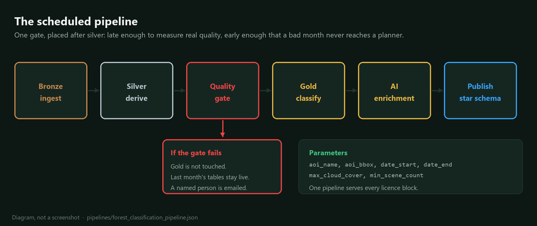

## Session 2 agenda: build it end to end

Four hours. By the end, every participant has a scheduled pipeline that pulls
Sentinel-2 imagery, classifies forest stands, writes gold Delta tables, and
drives a Power BI map through Direct Lake.

| Time  | Block                                                                       | Min |
|-------|------------------------------------------------------------------------------|-----|
| 0:00  | Homework debrief and today's problem statement                                | 15  |
| 0:15  | Step 1, get the imagery: Planetary Computer and STAC for your area            | 45  |
| 1:00  | Step 2, analyse it: Fabric notebook and GeoPandas, with Copilot writing most of the code | 50  |
| 1:50  | Break                                                                         | 15  |
| 2:05  | Step 3, add AI where it earns its place: Foundry, and where AI is quietly wrong | 45  |
| 2:50  | Step 4, publish it: Delta table, Direct Lake semantic model, Power BI map     | 45  |
| 3:35  | Step 5, make it repeatable, then the assignment and office hours              | 25  |
|       | Session total                                                                 | 240 |

## 0:00 Homework debrief and problem statement (15 min)

Three volunteers show their homework area of interest and the row count they
landed. Two minutes each, no slides.

Today's problem statement, stated once and referred back to all day:

> Woodlands planning needs a monthly, stand-level view of forest condition
> across the licence area, showing which stands are softwood, hardwood or
> mixedwood, which have been harvested since the last look, and which are showing
> moisture stress. It must refresh without anyone opening a notebook, and a
> planner must be able to filter it on a map.

Everything built today ladders back to that paragraph. When someone proposes an
addition, the test is whether it serves that sentence.

## 0:15 Step 1, get the imagery (45 min)

Notebook: `01_bronze_stac_ingest`

Teaching (15 min):

- STAC as a catalogue standard: Catalog, Collection, Item, Asset.
- Why a catalogue beats a file share: query by geometry, date and cloud cover,
  and get back signed hrefs to Cloud Optimized GeoTIFFs.
- Signing. Planetary Computer assets need a token appended, and the token
  expires. Sign late, not early, and never persist a signed href.
- Cloud Optimized GeoTIFF and range reads: you fetch the window you need, not
  the scene.
- What bronze means here. Store the scene catalogue and the raw windowed rasters.
  Do not reproject, do not mask, do not rename bands.

Hands-on (30 min):

1. Open the STAC API and search `sentinel-2-l2a` for the area of interest.
2. Filter on the date window and `eo:cloud_cover`, then rank and pick scenes.
3. Sign the items and load bands B04, B08, B11, B12 and SCL with `odc.stac`.
4. Write the raw window to `Files/bronze/scenes/` as GeoTIFF.
5. Write `bronze_scene_catalog` as Delta, one row per scene with the metadata
   you will need later to explain any number you publish.

Checkpoint: `bronze_scene_catalog` has at least two scenes and the raster files
exist on disk.

Facilitator note: cloud cover is the variable that breaks a live demo. Have a
fallback date window ready for a year where the area was clear, and say out loud
that this is exactly the problem the pipeline has to handle every month.

## 1:00 Step 2, analyse it with GeoPandas and Copilot (50 min)

Notebooks: `02_silver_reproject_and_indices` then `03_gold_forest_classification`

Teaching (12 min):

- Cloud masking from the Sentinel-2 scene classification layer, and which class
  values to drop.
- Spectral indices and what each one actually measures: NDVI for greenness, NDMI
  for canopy moisture, NBR for burn and harvest, and the red-edge behaviour that
  separates conifer from deciduous.
- Reprojection to EPSG:2953 and why you do it once, in silver, not per query.
- Zonal statistics: from a raster to one row per stand per date, which is the
  moment the data becomes joinable to everything else Woodlands holds.

Hands-on with Copilot (38 min):

This block is where Copilot writes most of the code. The instruction to the room
is to prompt with intent and constraints rather than syntax:

> "Given an xarray DataArray with bands B04, B08, B11 and B12, and a Sentinel-2
> SCL band, mask cloud, shadow and snow, then return NDVI, NDMI and NBR as a
> single dataset. Assume the input is not reprojected."

Then read what comes back with the specific question: what did it assume that I
did not tell it? Three assumptions worth catching in this exercise:

- Scale factor. Sentinel-2 L2A surface reflectance is stored as integers and
  needs dividing by 10000. Copilot often omits it, and NDVI still looks fine
  because the ratio cancels, but NDMI thresholds silently move.
- Nodata handling. Zero is a real reflectance value in shadow, so treating zero
  as nodata quietly deletes valid dark pixels.
- SCL class list. Getting the class numbers slightly wrong leaves thin cirrus in
  the data, and cirrus depresses NDMI in a way that reads as drought stress.

Checkpoint: `silver_stand_observations` has one row per stand per scene date,
and `gold_stand_classification` assigns a class to every stand with a confidence.

## 1:50 Break (15 min)

## 2:05 Step 3, add AI where it earns its place (45 min)

Notebook: `04_gold_ai_enrichment_foundry`

Teaching (15 min):

The honest version of the AI conversation.

Where a language model earns its place here:

- Turning twelve numeric columns into a two-sentence stand note a planner reads
  in the tooltip.
- Reconciling free-text field notes against the classified result and flagging
  disagreements for a human.
- Drafting the change narrative between two dates, so the map has a "what
  changed and why it might matter" panel.

Where it does not:

- Deciding the class. A threshold on NDVI and NDMI is auditable, reproducible,
  and free. A model that classifies from a prompt is none of those.
- Computing anything. If you ask a model for a mean, you get a plausible mean.
- Anything a forester will be asked to defend in a regulatory conversation
  without a traceable calculation behind it.

Where AI is quietly wrong, demonstrated live:

1. Ask the model to summarise a stand and include the area. It will happily
   restate a number you never gave it, or round one you did in a way that
   changes the meaning.
2. Ask it to classify a stand from index values with no threshold definition.
   Run it twice. The answers differ, and neither is wrong in a way you can point
   at.
3. Give it a stand with a missing NDMI and watch it interpolate an opinion
   rather than say the data is absent.

The mitigation pattern the notebook implements: constrain the output with a
JSON schema, pass only pre-computed values, forbid new numbers in the prompt,
validate the response against the source row, and write both the narrative and a
`validation_status` column. Anything that fails validation is written with the
narrative suppressed rather than dropped silently.

Hands-on (30 min): implement the enrichment with schema-constrained output and
the numeric guard, then deliberately break the guard and observe what gets
through.

Checkpoint: `gold_stand_narrative` exists, and at least one row carries a
`validation_status` other than `ok`, because the guard is doing its job.

## 2:50 Step 4, publish it (45 min)

Notebook: `05_publish_and_validate`, then the Power BI service.

Teaching (12 min):

- Direct Lake: the semantic model reads the Delta files directly, with no import
  and no DirectQuery round trip, and what causes a fallback to DirectQuery.
- Modelling for Direct Lake: a star schema, dates as a real date table, and no
  calculated columns that force a fallback.
- Geometry in Power BI: keep a latitude and longitude centroid alongside the
  WKB, because the map visual wants points and the shape map wants a boundary
  set you have registered.

Hands-on (33 min):

1. Build `gold_stand_facts` and `gold_dim_stand` with clean grain and keys.
2. Create the Direct Lake semantic model from the Lakehouse.
3. Add measures: stand count, area by class, harvested area since last period,
   and a moisture stress flag.
4. Build the report page: map by class, trend by month, and a table with the
   AI narrative in the tooltip.
5. Confirm Direct Lake is actually in use rather than silently falling back.

Checkpoint: a report page that answers the problem statement from 0:00.

## 3:35 Step 5, make it repeatable, assignment, office hours (25 min)

- Wire the five notebooks into a Fabric data pipeline with parameters for the
  area of interest and the date window. Definition in `pipelines/`.
- Add the schedule, the failure notification, and the one data quality gate that
  stops a bad month from reaching the report.
- Talk through what breaks in production: cloud cover in a month with no clear
  scene, an area of interest crossing a UTM zone boundary, a stand register
  update that changes stand IDs, and a model deployment version change in
  Foundry.
- Assignment brief: [08-assignment.md](08-assignment.md).
- Office hours: the last ten minutes are open, with facilitators circulating.

## Materials checklist

| Item                              | Where                                                     |
|-----------------------------------|------------------------------------------------------------|
| Slide deck                        | `decks/out/session-2-build-it-end-to-end.pptx`             |
| Student notebooks 01 to 05        | `notebooks/student/`                                       |
| Solution notebooks 01 to 05       | `notebooks/solutions/`                                     |
| Pipeline definition               | `pipelines/forest_classification_pipeline.json`            |
| Power BI build guide              | `powerbi/semantic-model-guide.md`                          |
| Fallback scenes, pre-staged       | `ws-woodlands-shared` Lakehouse `Files/bronze/scenes/`      |
