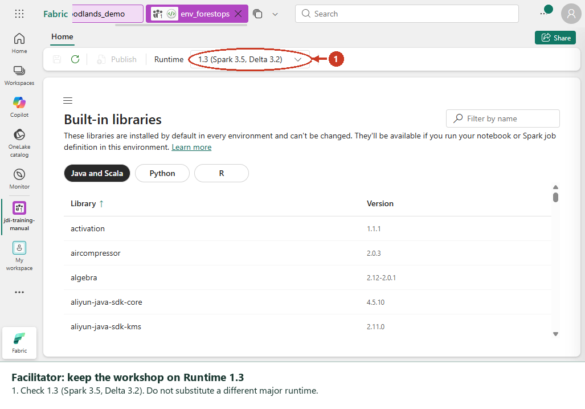
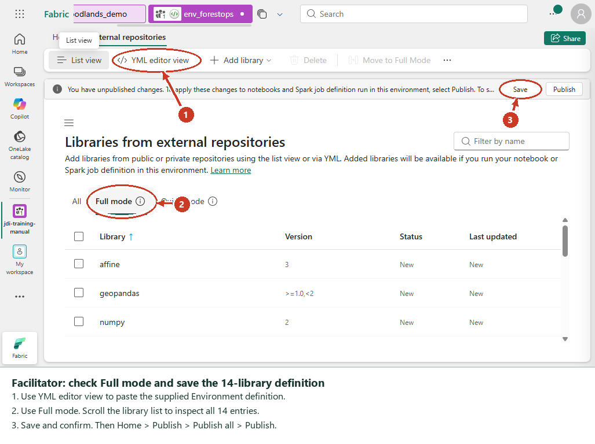
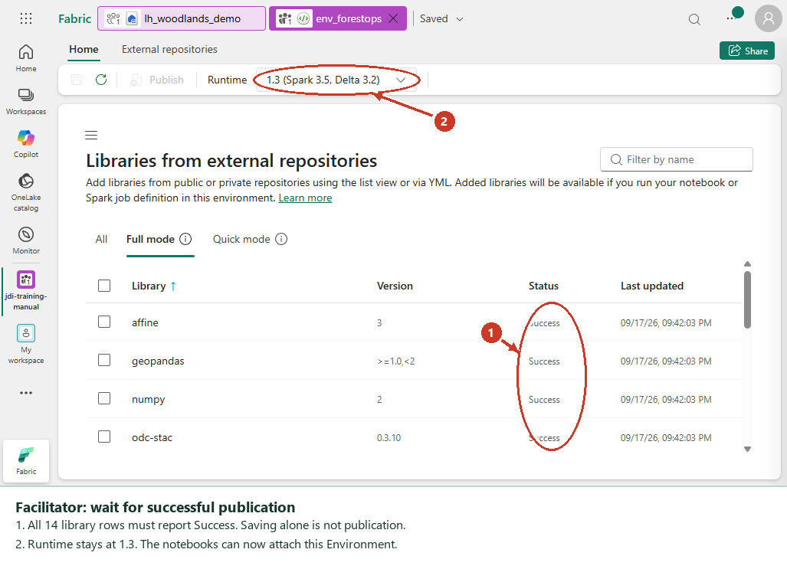
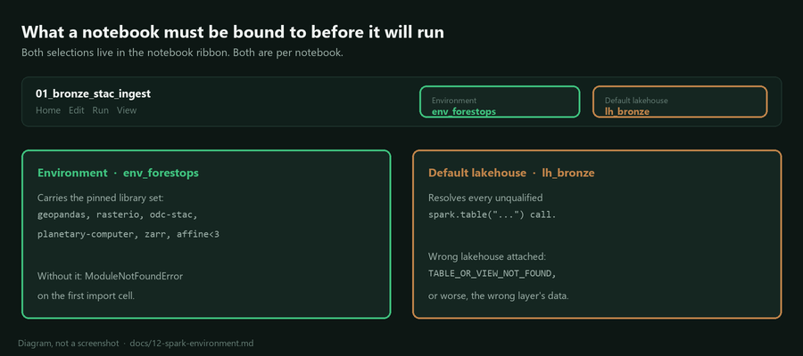

## Spark Environment setup

Every notebook in this workshop needs geospatial and STAC libraries that the
Fabric Spark runtime does not ship. This article explains why those libraries
arrive through a published Environment rather than a `%pip install` line, how to
build that Environment, and how to attach it.

Do this once per workspace before Session 1. A first publish took about six
minutes on an F64 in our build, so allow ten and start it before the room
arrives.

The [manual student walkthrough](16-manual-upload-labs.md) uses one published
Environment in `jdi-training-manual`, shared by the learner notebooks. The
separate [three-workspace layout](13-three-workspace-layout.md) needs one
Environment per workspace; its scripted setup is documented below.

## Manual Portal Setup

The facilitator performs this once in `jdi-training-manual`. Students import
their six notebooks, create their own lakehouse, then select this Environment.
Do not create another Environment for each learner.

### Create The Environment

1. Open the Contoso workspace `jdi-training-manual`. Confirm its assigned
  `rayfintestenv` F64 capacity is active.
2. Select **New item**, search for **Environment**, and select it.
3. Enter `env_forestops`, then select **Create**.
4. In the **Home** ribbon, check **Runtime 1.3** (Spark 3.5, Python 3.11), the
  workshop's previously verified runtime. If unavailable, stop for compatibility
  validation instead of selecting a different major runtime without testing.



### Import Libraries

1. Open the navigation menu, then **Libraries** > **External repositories**.
  On a wider screen the navigation is already visible.
2. Select **More items** (`...`) > **Import YML** > **Upload to Full mode**.
  Confirm **Import**, then select
  the [Environment YAML file](../environments/environment.yml) from the bundle's
  **handouts** folder.
3. Alternatively, select **YML editor view** > **Full mode**, select all editor
  text and paste the file contents with **Ctrl+V**. Return to **List view**.
  Do not upload the file as a custom Python library or add a top-level `name`:
  the portal accepts `channels` and `dependencies`, not a Conda environment name.
4. Confirm the list contains 14 libraries and the definition retains `numpy<2`, `pandas>=2.1,<3`,
  `typing-extensions>=4.15`, `affine<3`, `zarr>=2.16` and all the other supplied
  packages. Do not substitute the older unpinned requirements file.



### Publish And Check

1. Select **Save** and confirm **Save changes**. In **Home**, select **Publish**,
  review **Pending changes**, select **Publish all**, then confirm **Publish**.
2. Wait for success. Saving a draft or seeing **Publishing** is not completion.
  Allow about ten minutes; actual time varies.
3. Return to the workspace and confirm `env_forestops` is available. Attach it
  to each notebook using the Home ribbon selector.
4. Start a new session and run Lab 00's Environment check. Lab 01's raster load
  remains the functional check for the full geospatial stack.



Checkpoint: publication succeeded, every learner selects the Environment from
the correct workspace, and required imports pass. Do not substitute a
`%pip install` cell for a missing attachment.

If approved outbound policy blocks public packages, use the organization's
approved dependency process. Do not disable outbound protection. See
[libraries with limited network access](https://learn.microsoft.com/fabric/data-engineering/environment-manage-library-with-outbound-access-protection).

## Why not just use %pip install

The obvious approach is a `%pip install` cell at the top of each notebook. We
tried it against a live Fabric capacity and it fails in three separate ways, two
of them silent.

The Fabric Spark base runtime turns out to be much barer than most people
assume. A probe on 2026-09-02 against Runtime 1.3 (Python 3.11.8, Spark 3.5.5)
found only `numpy` 1.26.4 and `pandas` 2.1.4. There is no `geopandas`, no
`shapely`, no `rasterio` and no `xarray`, let alone the STAC packages.

Installing that stack ad hoc then causes the following.

The resolver upgrades packages the platform depends on. Installing the STAC
stack pulled `pandas` from 2.1.4 to 3.0.5 and `packaging` to 26.3, which breaks
`mlflow-skinny` and `ds-copilot`. Nothing fails at install time. The damage
surfaces later, somewhere unrelated.

`planetary_computer` fails to import with `ImportError: cannot import name
'Sentinel' from 'typing_extensions'`. The package pulls a `pydantic` that needs
a newer `typing_extensions` than the one baked into the Fabric cluster
environment, and the cluster copy wins on `sys.path`. The install reports
success; the import dies.

A failed `%pip` statement inside a scheduled job kills the whole Spark session
with `System_Cancelled_Session_Statements_Failed`, which tells you nothing about
which package caused it.

A published Environment resolves the set once, ahead of time, and surfaces
resolution failures at publish time instead of halfway through a workshop
exercise. That is the reason to prefer it, and it is worth saying out loud to
the room: this is the same choice a forestry team has to make when moving a
notebook from someone's laptop into a scheduled pipeline.

## What is pinned, and why

The library set lives in [environment.yml](../environments/environment.yml).
It does two jobs.

The first job is bringing in the stack the notebooks need: `shapely`,
`geopandas` and `pyproj` for vector geometry and the EPSG:2953 reprojection,
`rasterio`, `xarray` and `rioxarray` for the windowed Sentinel-2 reads, and
`pystac-client`, `planetary-computer` and `odc-stac` for Planetary Computer
access.

The second job matters more. Four pins exist purely to stop the resolver
producing a set that breaks at runtime.

| Pin | Reason |
|---|---|
| `numpy<2` | Keeps the base `numpy` 1.26 line, which the platform libraries are built against |
| `pandas>=2.1,<3` | Blocks the silent 2.1.4 to 3.0.5 upgrade that breaks mlflow and ds-copilot |
| `typing-extensions>=4.15` | Forces a version new enough for the `pydantic` behind `planetary-computer`, fixing the `Sentinel` import error |
| `affine<3` | `affine` 3.0.1 makes every `odc.stac.load` call fail. Details below |

Do not relax those four without re-probing the runtime. They encode failures we
actually hit, not defensive guesswork.

### The affine pin is the one that will bite you

Without `affine<3`, the resolver picks `affine` 3.0.1 and every raster load
fails with:

```text
TypeError: No '__dict__' attribute on 'Affine' instance to cache '_astuple' property.
```

The cause is upstream, not in our code. In `affine` 3.0.1 the `Affine` class
declares `__slots__`, so instances carry no `__dict__`, while `_astuple` is
declared as a `functools.cached_property`, which requires one. `Affine.__iter__`
returns `iter(self._astuple)`, so simply iterating a transform raises.
`odc-geo` 0.5.3 unpacks affine transforms when it works out the output geobox,
which puts the failure squarely in the middle of `odc.stac.load`.

Two things make this expensive to diagnose. The traceback is eight frames deep
in third-party code with nothing of ours in it, and Fabric reports the whole
notebook job as `System_Cancelled_Session_Statements_Failed`, which names no
cell and no exception. See
[14-debugging-notebook-failures.md](14-debugging-notebook-failures.md) for the
tracer that recovers the real traceback.

## Verified resolved versions

These are the versions the pins actually produced on Runtime 1.3, confirmed by
running the verification below against a live capacity. Both guards held: numpy
stayed exactly where the base runtime had it, and pandas moved only within the
2.x line.

| Package | Resolved | Package | Resolved |
|---|---|---|---|
| numpy | 1.26.4 | rioxarray | 0.19.0 |
| pandas | 2.3.3 | pystac-client | 0.9.0 |
| shapely | 2.1.2 | planetary-computer | 1.0.0 |
| geopandas | 1.1.4 | odc-stac | 0.5.3 |
| pyproj | 3.7.2 | rasterio | 1.4.4 |
| xarray | 2026.7.0 | affine | 2.4.0 |

## Build the Environment

The build is scripted so it is repeatable across the three workspaces.

```powershell
python scripts/fabric_environment.py build bronze
python scripts/fabric_environment.py wait  bronze
```

`build` creates an Environment named `env_forestops`, uploads
`environment.yml` as the external library set, and triggers a publish. `wait`
blocks until the publish reaches a terminal state, reporting progress as it
goes.

Repeat for `silver` and `gold`. Environments are workspace-scoped, so each of
the three workspaces needs its own copy.

Once a publish succeeds, confirm the stack really landed:

```powershell
python scripts/fabric_environment.py verify bronze
```

That deploys a notebook bound to the Environment which imports every expected
package, asserts `pandas` is still on the 2.x line, and runs a live STAC search
over the central New Brunswick block. It is a genuine end-to-end check rather
than a version listing.

## Attach the Environment to a notebook



In the Fabric portal, open the notebook, then use the Environment selector in
the ribbon and pick `env_forestops`. The session restarts against the published
library set.

If you are creating notebooks through the REST API, set the environment in the
notebook metadata alongside the default lakehouse:

```json
{
  "metadata": {
    "dependencies": {
      "environment": {
        "environmentId": "<environment id>",
        "workspaceId": "<workspace id>"
      },
      "lakehouse": {
        "default_lakehouse": "<lakehouse id>",
        "default_lakehouse_name": "lh_bronze",
        "default_lakehouse_workspace_id": "<workspace id>"
      }
    }
  }
}
```

You can also set the Environment as the workspace default under workspace
settings, which saves attaching it notebook by notebook. For a workshop that is
usually the right call.

## Troubleshooting

| Symptom | Cause | Fix |
|---|---|---|
| Publish ends in `Failed` | A pin cannot be resolved together with the rest of the set | Read the publish error in the portal, loosen the offending pin only, republish |
| `No '__dict__' attribute on 'Affine' instance` | `affine` 3.x resolved into the Environment | Confirm `affine<3` is in the yml, republish, restart the session |
| `No module named 'zarr'` on the last cell of notebook 01 | `zarr` missing from the Environment | Confirm `zarr>=2.16` is in the yml. All the real work succeeds before this fails |
| `ImportError: cannot import name 'Sentinel'` | `typing-extensions` pin missing or too low | Confirm `typing-extensions>=4.15` is in the yml and the Environment is actually attached |
| `ModuleNotFoundError` for `geopandas` or `rioxarray` | Notebook is running on the base runtime | The Environment is not attached, or the session started before it was |
| Assertion that pandas was upgraded | Something reintroduced an unpinned install | Look for a stray `%pip install` cell and remove it |
| `System_Cancelled_Session_Statements_Failed` and nothing else | Any uncaught exception in a scheduled notebook run | Run `python scripts/fabric_trace_notebook.py <notebook> <layer>` to recover the real traceback |
| Session takes several minutes to start | Expected | Environment-backed sessions start slower than base runtime sessions. Warm one before the room arrives |

## What to tell the room

This is worth five minutes of Session 1 rather than being skipped as plumbing.
The teaching point is that the version of a library is part of the pipeline, and
that a notebook which works today can break tomorrow because a transitive
dependency moved underneath it. The `pandas` upgrade above is a good example:
nothing errored, and the breakage landed somewhere entirely unrelated to the
code anyone had changed.

## References

- [Create, configure, and use an environment in Fabric](https://learn.microsoft.com/fabric/data-engineering/create-and-use-environment)
- [Manage Apache Spark libraries in Microsoft Fabric](https://learn.microsoft.com/fabric/data-engineering/library-management), which covers why inline installation is discouraged in a shared workspace
- [Manage libraries in Fabric environments](https://learn.microsoft.com/fabric/data-engineering/environment-manage-library)
- [Apache Spark runtimes in Fabric](https://learn.microsoft.com/fabric/data-engineering/runtime), for what the base image already ships and which runtime version you are pinning against
- [Manage libraries with limited network access in Fabric](https://learn.microsoft.com/fabric/data-engineering/environment-manage-library-with-outbound-access-protection), the wheel-upload path when the workspace cannot reach PyPI

More in [docs/15-resources-and-learning-paths.md](15-resources-and-learning-paths.md).
