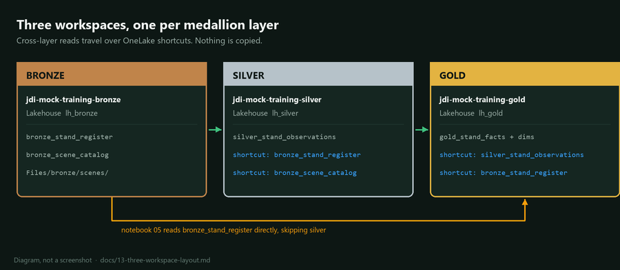

## Three-workspace layout

The workshop runs across three Fabric workspaces, one per medallion layer,
rather than one workspace with three lakehouses. This article explains the
wiring, the setup order, and the one piece of sequencing that catches people out.

## Why three workspaces

A single workspace with three lakehouses would be simpler to set up and would
teach the wrong lesson. Separating the layers by workspace buys three things
that matter to a woodlands team running this for real.

Permissions become per-layer. An analyst who should read gold does not
automatically get write access to bronze. That distinction is hard to retrofit
later and trivial to establish now.

Blast radius shrinks. A notebook with the wrong default lakehouse attached
fails loudly instead of quietly writing silver output into bronze.

The dependency direction becomes visible. Because cross-layer reads have to go
through an explicit shortcut, you can see at a glance what each layer depends
on. In a single workspace every table is reachable from everywhere, and the
architecture exists only in someone's head.

## The layout



| Layer | Workspace | Lakehouse | Environment | Notebooks |
|---|---|---|---|---|
| Bronze | `jdi-mock-training-bronze` | `lh_bronze` | `env_forestops` | 00, 01 |
| Silver | `jdi-mock-training-silver` | `lh_silver` | `env_forestops` | 02 |
| Gold | `jdi-mock-training-gold` | `lh_gold` | `env_forestops` | 03, 04, 05, 06 |

Each notebook declares its own layer in the configuration cell:

```python
LAYER = "silver"
WORKSPACE = "jdi-mock-training-silver"
LAKEHOUSE = "lh_silver"
```

That is not decoration. Every `spark.table("...")` call in these notebooks is
unqualified, so it resolves against whichever lakehouse is attached as the
notebook default. Attach the wrong one and the reads fail or, worse, the writes
land somewhere unexpected.

## How cross-layer reads work

Notebooks read upstream tables by plain name, for example
`spark.table("bronze_stand_register")` from the silver workspace. That works
because of a OneLake shortcut in `lh_silver` pointing at the bronze table.

A shortcut is a reference, not a copy. There is one physical copy of the data,
in the layer that produced it. Nothing is duplicated and nothing drifts.

The dependency graph is small enough to hold in your head:

```
bronze_stand_register ──┬──> silver (notebook 02)
                        └──> gold   (notebook 05)
bronze_scene_catalog  ─────> silver (notebook 02)
silver_stand_observations ─> gold   (notebook 03)
```

The bronze-to-gold edge surprises people. Notebook 05 builds the star schema and
needs the original stand register for its dimension table, so it reaches past
silver directly to bronze. If you only wire silver-to-bronze and gold-to-silver,
notebook 05 fails and the cause is two layers away from the error.

## Setup order

The sequencing constraint is the thing to internalise: a table shortcut needs a
real target table. You cannot create a shortcut to `bronze_stand_register`
before notebook 00 has written it. Files-level shortcuts have no such
restriction, because the `Files` folder exists from the moment the lakehouse
does.

So setup interleaves with the first run:

1. Create the three workspaces and lakehouses.
2. Build and publish `env_forestops` in each workspace. See
   [12-spark-environment.md](12-spark-environment.md).
3. Create the Files-level shortcuts. These can be done immediately.
4. Run notebooks 00 and 01 in the bronze workspace.
5. Create the table shortcuts into silver, now that bronze has tables.
6. Run notebook 02 in the silver workspace.
7. Create the table shortcuts into gold.
8. Run notebooks 03 through 06 in the gold workspace.

Steps 3, 5 and 7 are the same command. It is idempotent and reports what it did:

```powershell
pwsh -File scripts/fabric_create_shortcuts.ps1            # Files only
pwsh -File scripts/fabric_create_shortcuts.ps1 -Tables    # Files + Tables
```

Output tells you which of the three states each shortcut is in:

```
  OK      silver/Tables/bronze_stand_register -> bronze
  EXISTS  silver/Files/bronze -> bronze
  PENDING gold/Tables/silver_stand_observations -> silver  (upstream table not written yet)
```

`PENDING` is the expected state before the upstream notebook has run. It is not
an error. Re-run the command after the upstream layer produces data.

## Creating shortcuts in the portal

Students who prefer the UI, or who are working in their own workspaces for the
homework, can create the same shortcuts by hand.

1. Open the downstream lakehouse, for example `lh_silver`.
2. In the Explorer pane, select the ellipsis next to **Tables**, then
   **New shortcut**.
3. Choose **Microsoft OneLake**.
4. Pick the upstream lakehouse, for example `lh_bronze`.
5. Tick the table you want, for example `bronze_stand_register`.
6. Confirm. The table now appears under `Tables` in the downstream lakehouse
   with a shortcut badge on the icon.

Repeat for each entry in the dependency graph above. For the Files-level
shortcut, do the same from the ellipsis next to **Files** and select the whole
`Files` folder rather than an individual table.

## Troubleshooting

| Symptom | Cause | Fix |
|---|---|---|
| `RequestBodyValidationFailed` when creating a table shortcut | The target table does not exist yet | Run the upstream notebook first. The error code is misleading; the payload is fine |
| `AnalysisException: Table or view not found` in notebook 02 or 03 | The table shortcut was never created | Re-run the shortcut script with `-Tables` |
| Notebook 05 fails on `bronze_stand_register` but 03 works | Only the silver-to-bronze shortcut was created | Gold needs its own shortcut to bronze, see the dependency graph |
| Writes land in the wrong lakehouse | Wrong default lakehouse attached | Check `LAKEHOUSE` in the config cell against what the ribbon shows |
| Raster reads fail in notebook 02 | Files shortcut missing, or path assumes a single lakehouse | Bronze files surface at `Files/bronze/` inside `lh_silver` |

## What to tell the room

The teaching point here is that the medallion layers are a contract, not a
naming convention. Bronze holds what arrived. Silver holds what you can defend.
Gold holds what someone will make a decision from. Putting a workspace boundary
between them makes the contract enforceable rather than aspirational, and the
shortcut graph is the written form of that contract.

Worth showing live: open `lh_silver`, point at `bronze_stand_register` with its
shortcut badge, and note that the data has not moved. Most people assume a copy.
