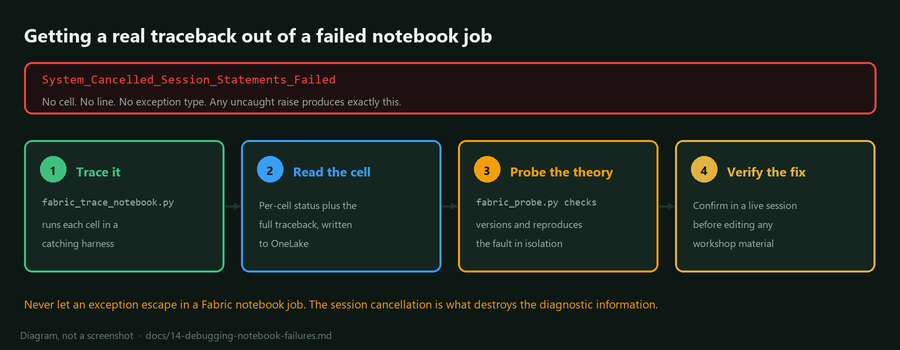

## Debugging a failed Fabric notebook run

When a scheduled notebook job fails, the Fabric jobs API returns this:

```json
{
  "errorCode": "System_Cancelled_Session_Statements_Failed",
  "message": "System cancelled the Spark session due to statement execution failures",
  "isRetriable": false
}
```

No cell, no line, no exception type, no traceback. Any uncaught exception
anywhere in the notebook produces exactly this, so it tells you only that
something went wrong.

This page is how to get the real answer in about three minutes instead of
guessing for an afternoon. Every technique here was used to find genuine bugs
while building this workshop.



## What does not work

Save yourself the detour.

The Livy sessions API looks promising and is not:

```powershell
GET https://api.fabric.microsoft.com/v1/workspaces/{workspaceId}/spark/livySessions
```

It returns session state, timings and a `cancellationReason`, but the
`cancellationReason` is the same generic sentence as the job error. There is no
cell-level detail in it.

Opening the notebook in the portal and re-running interactively often does work,
but it changes the thing you are debugging. An interactive session has a
different lifetime and different failure behaviour from a scheduled run, and
some failures do not reproduce.

## The tracer

`scripts/fabric_trace_notebook.py` takes the real notebook, base64-encodes every
code cell, and executes them one at a time inside a harness that catches
everything. The first failure is recorded with its full traceback, execution
stops there, and the results are written to OneLake.

```powershell
python scripts/fabric_trace_notebook.py 01_bronze_stac_ingest bronze
pwsh -NoProfile -File scripts/fabric_fetch_json.ps1 bronze trace_01_bronze_stac_ingest.json
```

The output is one entry per cell:

```json
[
  { "cell": 5, "ok": true,  "head": "sample = items[0]" },
  { "cell": 6, "ok": false, "head": "import odc.stac",
    "error": "...TypeError: No '__dict__' attribute on 'Affine' instance..." }
]
```

That is the actual bug, with the actual line, in the actual scheduled-run
environment.

Two details make this work. Cells are base64-encoded so no amount of quoting,
f-strings or embedded JSON in the notebook can break the harness. And all cells
share one namespace via `exec(source, namespace)`, so cell six still sees the
variables cell five defined, exactly as a real run would.

## The probe

Once you know which cell failed, the next question is usually about the
environment rather than the code. `scripts/fabric_probe.py` runs an arbitrary
snippet in a real session and brings the answers back:

```powershell
python scripts/fabric_probe.py bronze scripts/probes/affine_versions.py affine.json
pwsh -NoProfile -File scripts/fabric_fetch_json.ps1 bronze affine.json
```

The probe file builds a dict named `findings`. The harness serialises it to
OneLake and you download it. There are worked examples in `scripts/probes/`:
library versions, a STAC connectivity check, a Zarr round-trip test, and the
full pipeline data verification.

## The rule that makes all of this necessary

**Never let an exception escape in a Fabric notebook job.**

A raise cancels the Spark session, and the session cancellation is what
destroys the diagnostic information. A notebook that fails loudly in an
interactive session fails silently and unattributably in a scheduled one.

So when you are investigating, wrap everything:

```python
findings = {}


def record(key, fn):
    """Record the outcome without ever letting it raise."""
    try:
        findings[key] = {"ok": True, "value": str(fn())[:600]}
    except Exception as exc:
        findings[key] = {"ok": False, "value": f"{type(exc).__name__}: {exc}"[:600]}


record("affine_version", lambda: __import__("affine").__version__)
record("iterate_a_transform", lambda: list(Affine.identity()))
```

Then write `findings` to `/lakehouse/default/Files/<name>.json` and download it.
Notebook stdout is not retrievable through the jobs API, so a `print` you cannot
read is not a diagnostic.

This is the opposite of what you want in production notebooks, where the
pipeline should stop on a genuine problem. It is specifically an investigation
technique.

## Reading the results back

Files written into a lakehouse are readable over the OneLake DFS endpoint with
a storage-scoped token:

```powershell
$token = az account get-access-token --resource "https://storage.azure.com" `
    --query accessToken -o tsv
$url = "https://onelake.dfs.fabric.microsoft.com/$workspaceId/$lakehouseId/Files/findings.json"
Invoke-RestMethod -Uri $url -Headers @{ Authorization = "Bearer $token" }
```

Note the audience. The Fabric REST API wants `https://api.fabric.microsoft.com`
and OneLake wants `https://storage.azure.com`. Using the wrong one gives a 401
that reads like a permissions problem.

`scripts/fabric_fetch_json.ps1 <layer> <filename>` wraps this.

## Worked example: three real bugs

All three were found this way, in order, while getting the pipeline to run end
to end for the first time.

**One.** Notebook 01 failed after 72 seconds. The tracer put it on cell 6,
`odc.stac.load`, with `TypeError: No '__dict__' attribute on 'Affine' instance`.
A probe confirmed `affine` had resolved to 3.0.1, in which `Affine` declares
`__slots__` while `_astuple` is a `functools.cached_property`, so iterating any
transform raises. Fixed by pinning `affine<3`. See
[12-spark-environment.md](12-spark-environment.md).

**Two.** Same notebook, now failing at 130 seconds. The tracer put it on the
last cell: `ModuleNotFoundError: No module named 'zarr'`. Every piece of real
work had already succeeded, and the notebook died writing its handoff cache.
Fixed by adding `zarr` to the Environment.

**Three.** Notebook 02 then failed with our own guard, `raster has no CRS`. A
probe showed why: xarray writes `spatial_ref` to Zarr as a plain data variable
rather than a coordinate, and rioxarray only looks for the CRS in `.coords`.
Calling `rio.write_crs()` before writing does not help. The probe tested the fix
before any notebook was edited, confirming that `set_coords("spatial_ref")`
restores `EPSG:32619` on read.

The pattern in all three: get the real traceback first, form the theory second,
and verify the fix with a probe before editing the material.

## When the notebook succeeds but the data is wrong

A job status of `Completed` means nothing raised. It does not mean the numbers
are right.

`scripts/probes/pipeline_data_verify.py` checks the output rather than the exit
code: grain uniqueness, index values inside their physical range, referential
integrity across the star schema, map centroids landing in New Brunswick, and
whether stands missing from the classification are explained by the valid-pixel
gate rather than lost silently.

That check is what surfaced the fourth bug in this pipeline, which no traceback
would ever have shown: the scene catalogue was recording `epsg = 0` for every
scene, because the STAC projection extension renamed `proj:epsg` to `proj:code`
and the notebook only read the old spelling. Nothing failed. The provenance was
simply, quietly, absent.
