## Start Here

Use **Microsoft Fabric in your browser**. Upload all six notebooks first,
create your lakehouse, attach the Environment, complete Labs 00-05, then
manually create a **Map** and a **Fabric data agent**.

Allow a full workshop day. You need basic Python familiarity to complete the
numbered TODO exercises. Use public Sentinel-2 imagery and synthetic stands,
not JDI production inventory.

Use the files in [notebooks/student](../notebooks/student). Each has a visible
`Lab NN` title, a **Student notebook** banner, numbered `TODO` exercises and
validation cells. The matching [solutions](../notebooks/solutions) are answer
keys. Do not upload the Python authoring sources or solution files as your work.

No local Python, Node.js, Docker, Power BI Desktop, Foundry endpoint or Azure
OpenAI key is required. The notebooks contain only the required six-lab workflow.
For imagery, choose [manual download/upload or automatic STAC](17-manual-imagery-download.md).

> [!IMPORTANT]
> Screenshots show completed example notebooks. Your student notebooks retain
> their TODO exercises, and imagery-dependent counts can differ. Complete the
> checks using your own results; do not copy the screenshot counts.

### Your Names

Use one short identifier, such as `demo`, throughout. Replace `demo` with your
own identifier when working alongside other students.

| Item              | Example name            | Who creates it                  |
|-------------------|-------------------------|---------------------------------|
| Workspace         | `jdi-training-manual`    | Facilitator, once               |
| Capacity          | `rayfintestenv` (F64)    | Existing; do not recreate       |
| Notebook folder   | `student-demo`          | You                             |
| Lakehouse         | `lh_woodlands_demo`      | You, after all notebook uploads |
| Environment       | `env_forestops`          | Facilitator, once               |
| Map               | `map_woodlands_demo`     | You, after Lab 05               |
| Fabric data agent | `agent_woodlands_demo`   | You, after checking Gold data   |

Each learner or pair uses a separate lakehouse. Folders alone do not isolate
table writes. Workspace Contributors can still access one another's items;
these names prevent accidental overwrites, not unauthorized access.

## 1. Open Your Workspace And Folder

The facilitator completes [workspace preparation](#facilitator-workspace-preparation)
and [Environment setup](12-spark-environment.md#manual-portal-setup) before class.
You need the extracted workshop bundle and Contributor or higher workspace access.

1. Sign in to [Fabric](https://app.fabric.microsoft.com) with your Contoso account.
2. Select **Workspaces** > **jdi-training-manual**. Check the workspace name.
   Leave the older `jdi-training` reference workspace and its results unchanged.
3. Select **New folder**, enter `student-demo`, and select **Create**.
4. Open your new folder before importing the notebooks.

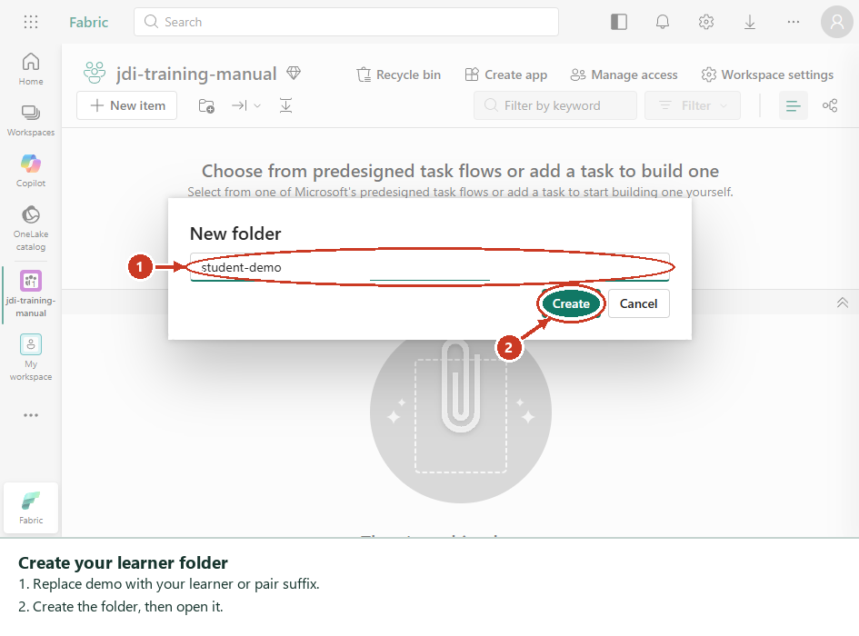

## 2. Upload All Six Notebooks

Use **Import** > **Notebook** > **From this computer** > **Upload**.
Repeat for one file at a time. Do not create the lakehouse or run a notebook yet.

Download the workshop bundle supplied by your facilitator and extract it on
your computer. Locate the **student** folder before opening the Upload
dialog. Keep the `.ipynb` extension; do not upload Python source files or a ZIP.

| Order | Student File                                                                                         | Purpose                         |
|-------|------------------------------------------------------------------------------------------------------|---------------------------------|
| 00    | [00_setup_lakehouse_and_config_STUDENT.ipynb](../notebooks/student/00_setup_lakehouse_and_config_STUDENT.ipynb) | Create the stand register        |
| 01    | [01_bronze_stac_ingest_STUDENT.ipynb](../notebooks/student/01_bronze_stac_ingest_STUDENT.ipynb)               | Discover and ingest imagery      |
| 02    | [02_silver_reproject_and_indices_STUDENT.ipynb](../notebooks/student/02_silver_reproject_and_indices_STUDENT.ipynb) | Mask, reproject and derive indices |
| 03    | [03_gold_forest_classification_STUDENT.ipynb](../notebooks/student/03_gold_forest_classification_STUDENT.ipynb) | Classify and detect change       |
| 04    | [04_gold_ai_enrichment_foundry_STUDENT.ipynb](../notebooks/student/04_gold_ai_enrichment_foundry_STUDENT.ipynb) | Add guarded offline narratives   |
| 05    | [05_publish_and_validate_STUDENT.ipynb](../notebooks/student/05_publish_and_validate_STUDENT.ipynb)         | Build and validate Gold tables   |

1. Open your notebook folder in the workspace.
2. Select **Import** from the workspace toolbar.
3. Select **Notebook**, then **From this computer**.
4. In the **Import status** pane, select **Upload**.
5. Select only the Lab 00 `.ipynb` file from the student folder.
6. Wait for **Imported successfully** and confirm the notebook appears in the
   folder. A waiting/importing message is not completion.
7. Repeat Steps 2 through 6 separately for Labs 01, 02, 03, 04 and 05.
8. Sort by **Name**. Confirm the list contains exactly six learner notebooks,
   with consecutive prefixes 00 through 05. There is no Lab 06.
9. If a name conflicts, cancel the overwrite. Rename your local copy with a
   participant suffix, for example `_STUDENT_demo.ipynb`, and import again.
   Keep the leading number and `_STUDENT`. Never replace another learner's work.

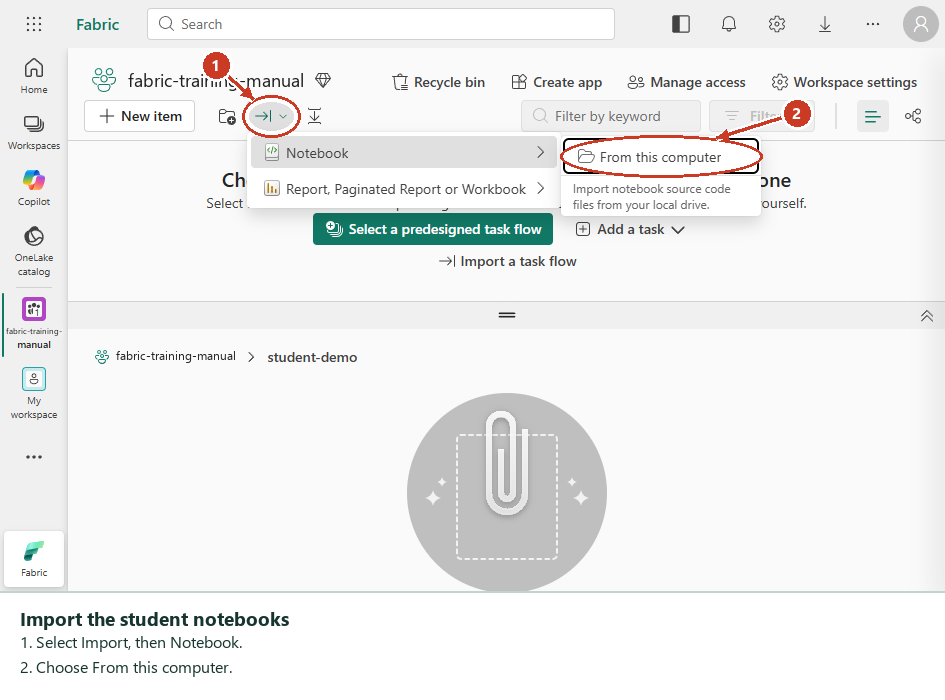

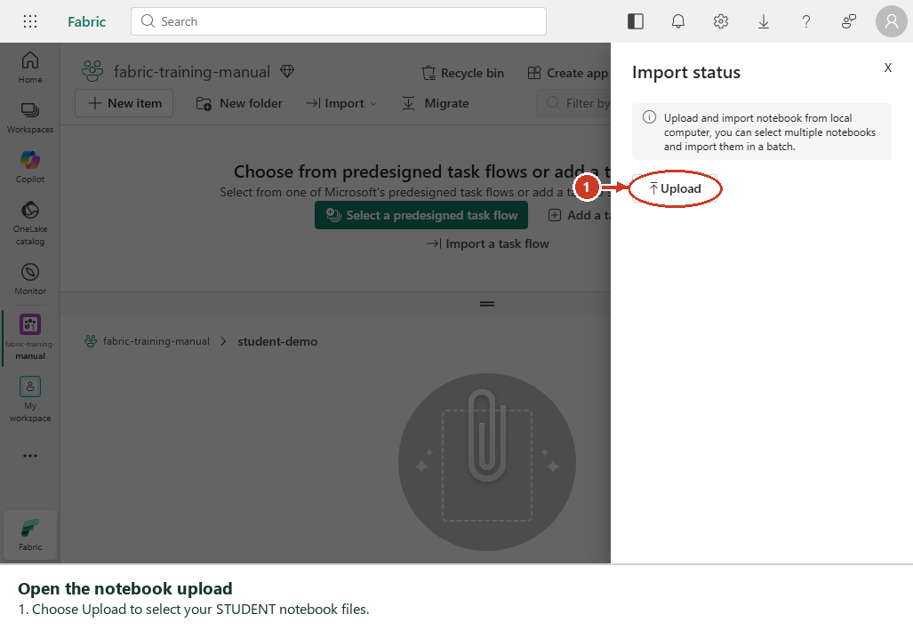

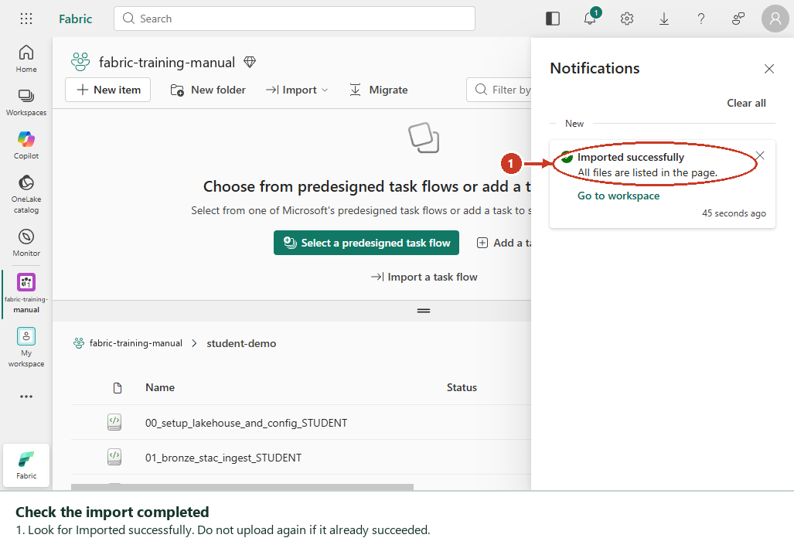

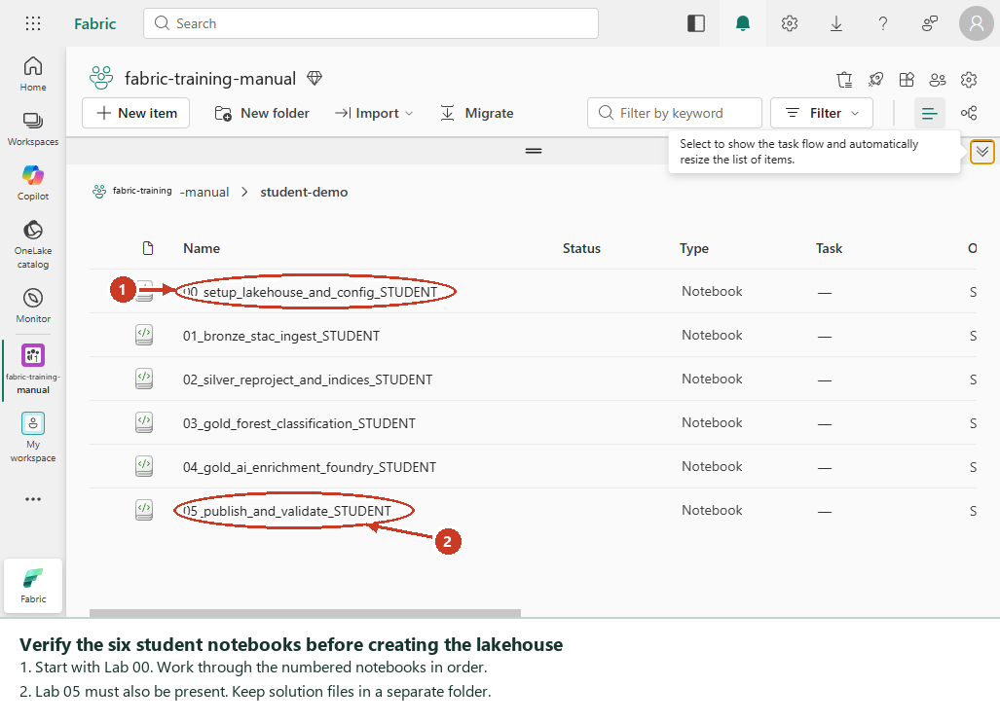

Checkpoint: all six student notebooks are present before you create the lakehouse.

## 3. Create Your Lakehouse Manually

1. Return to your learner folder in the `jdi-training-manual` workspace.
2. Select **New item** > **All items**, search for **Lakehouse**, and select it.
3. Enter `lh_woodlands_demo`. Keep **Lakehouse schemas** checked.
4. Select **Create** and wait for the lakehouse to open.
5. Confirm Explorer shows **Tables** > **dbo** and **Files**. Both are empty
   before Lab 00 runs.

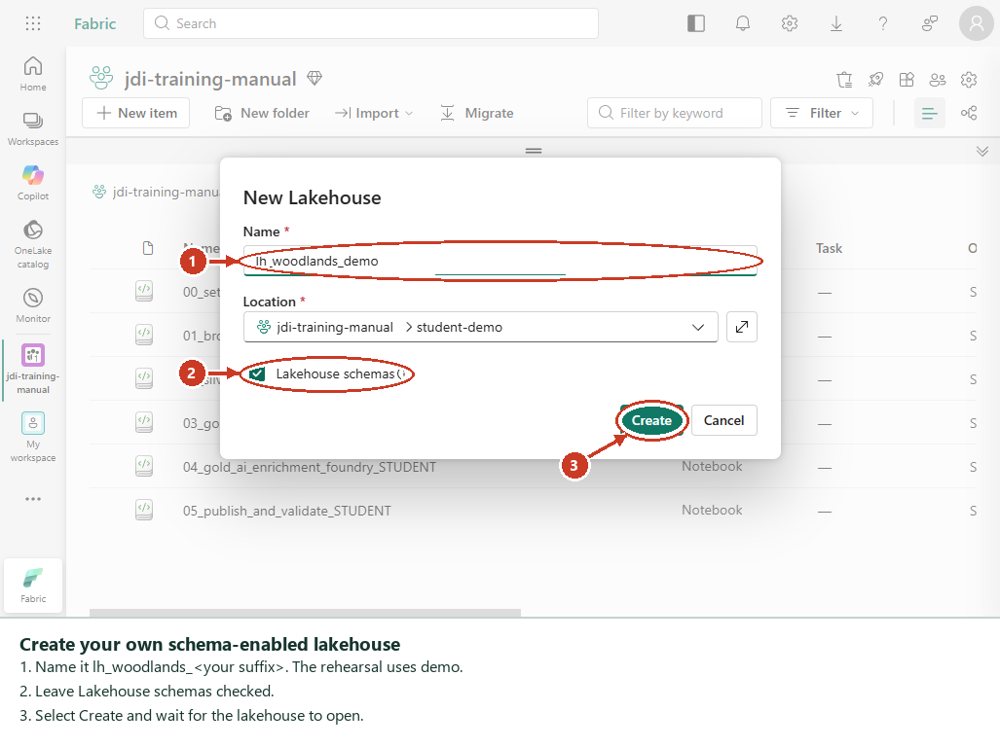

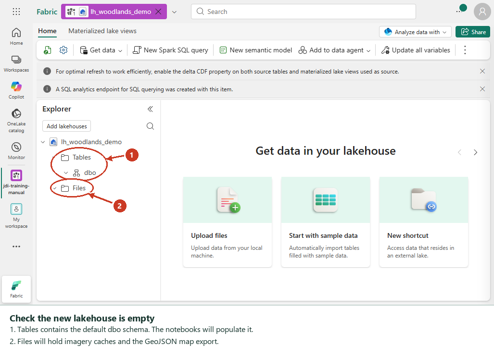

Fabric also creates a similarly named SQL analytics endpoint. Attach the
**Lakehouse** item to notebooks, not that endpoint. Do not manually create
Bronze, Silver or Gold tables; the notebooks write them.

## 4. Attach Every Notebook

The facilitator's published `env_forestops` supplies the geospatial libraries.
If missing or unpublished, stop and use
[manual Environment setup](12-spark-environment.md#manual-portal-setup).
Do not repair an attachment by running `%pip install`.

Repeat these steps for all six learner notebooks. An imported filename or a
`WORKSPACE` variable in code does not attach its data source.

1. Open the notebook and verify its visible `Lab NN` heading and Student banner.
   The banner is Cell 1; the lab title is Cell 2.
2. Dismiss an optional product tour with **Skip for now**.
3. Confirm the language is **PySpark (Python)**, not SparkR.
4. In the Home ribbon, open **Environment**. A fresh import may show
   **Workspace default**. On a narrow screen, first open the ribbon's **More
   items** menu (`...`). Select **Change environment**.
5. Select the `env_forestops` row whose **Location** is exactly `jdi-training-manual`,
   then select **Confirm**. Other workspaces have environments with the same name.
6. In Explorer, select **Add data items**, then **From OneLake catalog**.
   In older portal layouts this is **Add lakehouse**.
7. Filter to `lh_woodlands_demo`. Select the **Lakehouse** row in `jdi-training-manual`,
   not the same-named SQL analytics endpoint,
   then select **Connect** or **Add**, as shown by your portal.
8. Open the lakehouse's **More options** (`...`) menu and select **Set as default
   lakehouse**. Do not assume **Add** establishes the default. Wait for saving,
   reopen the notebook, and confirm the Environment and lakehouse are still
   attached before running any code.
9. If you already started a Spark session, stop it and reconnect after changing
   attachments. Do not run exercises against the old session configuration.
10. In each configuration cell where these labels occur, set
   `WORKSPACE = "jdi-training-manual"` and `LAKEHOUSE = "lh_woodlands_demo"`.
   Use your identifier instead of `demo`. These strings do not establish attachments.

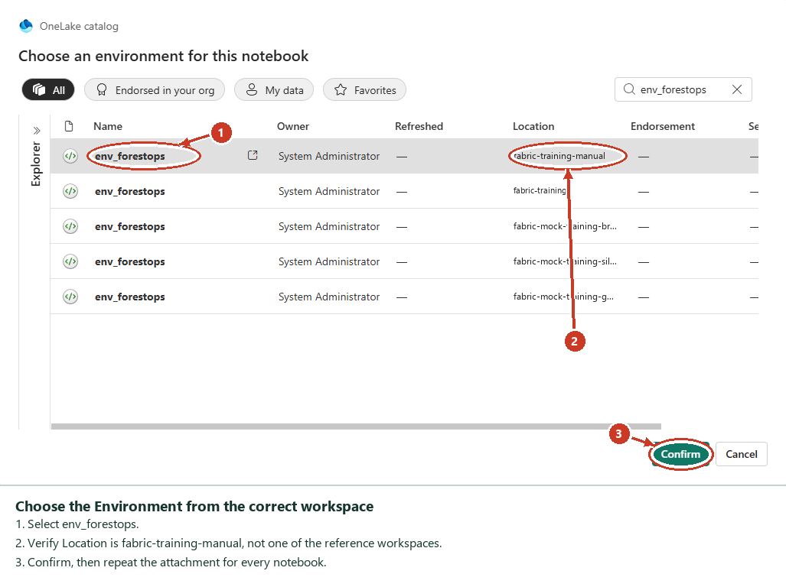

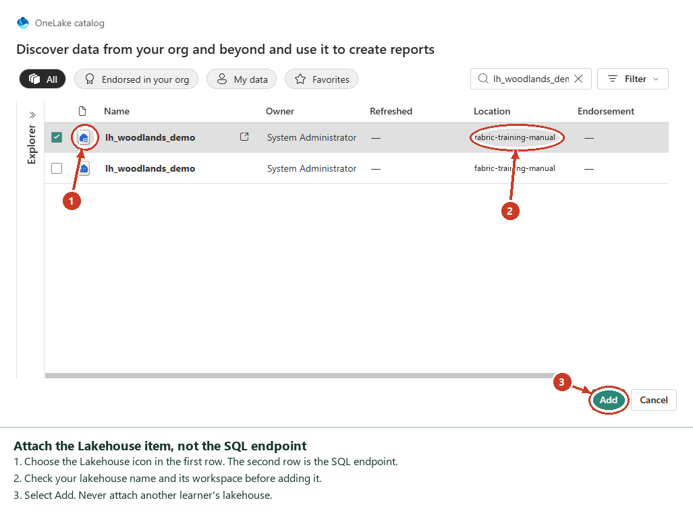

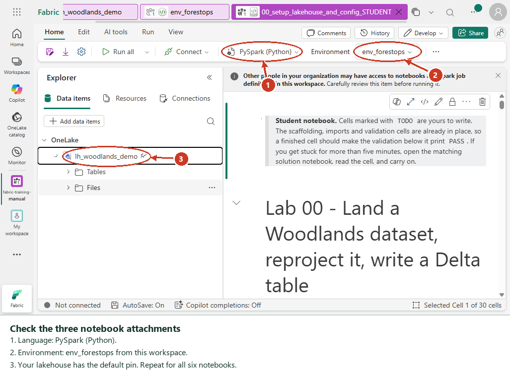

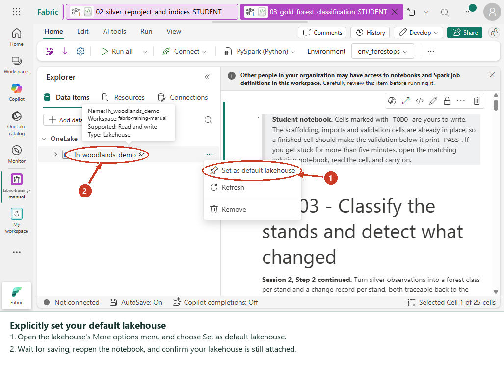

Checkpoint: all six notebooks use PySpark, the published Environment and your
own pinned lakehouse. Keep table names unchanged; they resolve under `dbo` in
that default lakehouse.

## 5. Complete The Exercises

### Working Cycle

1. Confirm your default lakehouse and obtain the facilitator's Spark execution slot.
2. Read the markdown before each code cell.
3. Complete each applicable numbered `TODO`. In Lab 01 manual mode, the online
   catalogue/search TODOs are inactive; all shared exercises remain required.
4. Select the cell's triangular **Run cell** control and wait for completion.
   Run its validation cell. Continue only after the expected checks pass.
5. Stop at any exception or `[FAIL]`, even if Fabric allows later cells to run.
   Some teaching checks print a failure rather than raise an exception.
6. Use the matching solution to understand a blocked exercise. Student and
   solution cell numbers can differ; match the section heading too.
7. Verify the output table/files, then capture the checkpoint before opening
   the next lab. Do not use **Run all** on an unfinished student notebook.

Cell numbers below refer to the supplied student files, before adding or
removing cells. They are navigation aids, not execution order: run all code
cells from top to bottom, not only the exercise cells listed.

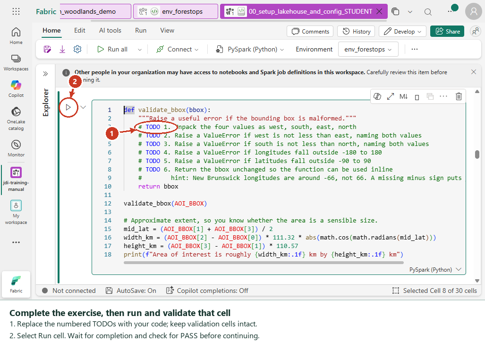

### Lab 00: Land The Stand Register

Exercise cells: **8, 14, 20, 21, 23 and 27**. Allow about 50 minutes.

1. Run the Environment check in Cell 4; it must report the packages available.
2. In Cell 6, keep the supplied area, `USE_SYNTHETIC_STANDS=True`, count 120,
   `WORKSPACE="jdi-training-manual"` and your own lakehouse name.
3. Complete bounding-box validation. Confirm reversed longitude and impossible
   latitude fail the exercise checks.
4. Generate synthetic stands in EPSG:2953. Complete the attributes and hectare
   calculation in the projected CRS, not in latitude/longitude degrees.
5. Complete WKB serialization, Delta writing and geometry readback.
6. Add WGS84 centroid longitude/latitude and verify they fall within the area.
7. Inspect `bronze_stand_register`. The reference has 120 unique stand IDs.
8. Capture `05-lab-00.png` with the lab title and final validation or table.

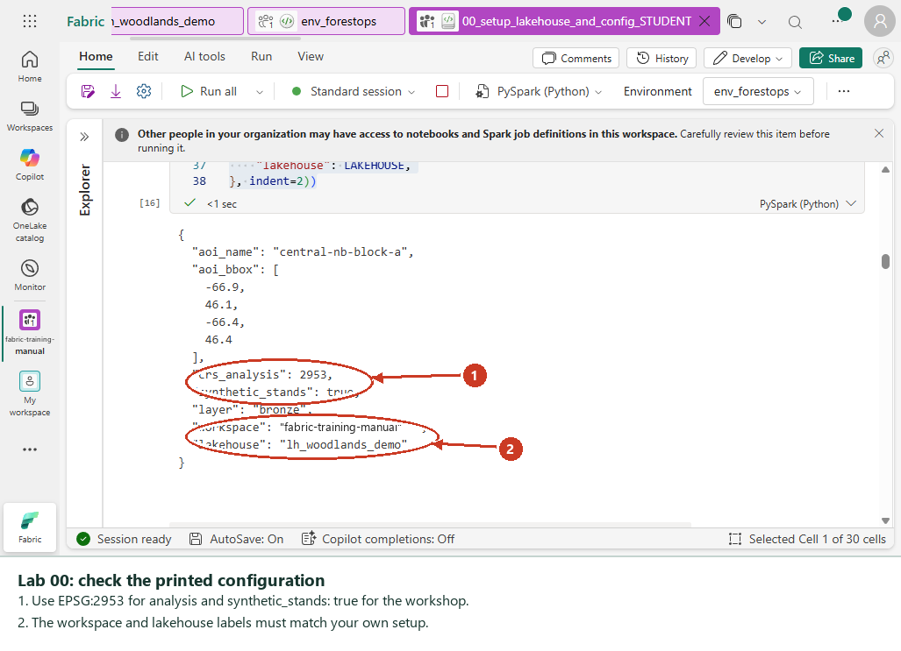

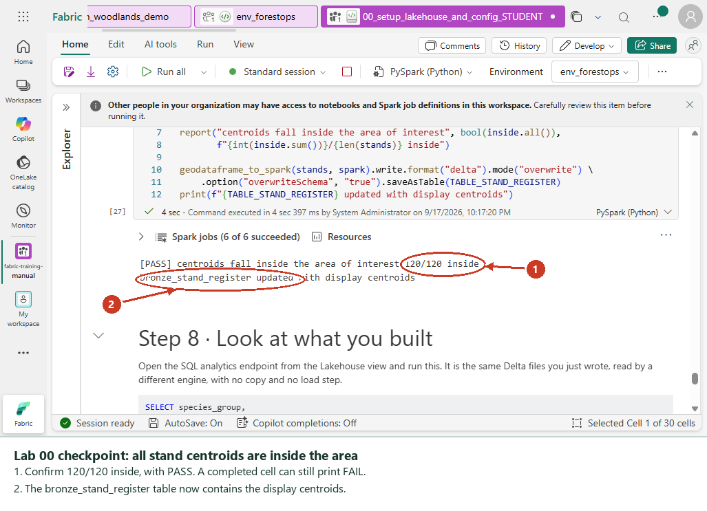

The synthetic sampling cells are larger than many real forest stands. Use the
supplied geometry-derived area check, not a 500 ha maximum.

### Lab 01: Ingest Sentinel-2 Imagery

Manual-route exercise cells: **17, 24, 26 and 30**. The automatic route also uses
**9 and 11**. Allow about 45 minutes after the file download/upload completes.

1. Confirm Lab 00 is complete and the same lakehouse is attached.
2. Keep the supplied area and June 1 through August 31, 2026 window. The initial
   limit is six scenes, cloud cover below 20%, at 20 m resolution.
3. Follow [the imagery handout](17-manual-imagery-download.md) to download five
   original TIFF bands and `item.json`, then upload them to your lakehouse.
   Keep `INPUT_MODE="manual"` in Cell 6. Alternatively choose `"stac"` and
   complete the online catalogue and search exercises.
4. Complete the shared windowed load for B04, B08, B11, B12 and SCL. Manual
   mode reads only uploaded files. Do not persist signed asset URLs.
5. Write and inspect `bronze_scene_catalog`, then complete the Bronze file writes
   and final cache-writing cell. Lab 02 always reads that persisted dataset.
6. Verify files under `Files/bronze/scenes/central-nb-block-a/` and the catalogue
   validation. The manual example contains one scene; the automatic reference
   contains six. An empty selection is a stop.
7. Capture `06-lab-01.png`. Avoid output that contains signed URLs.

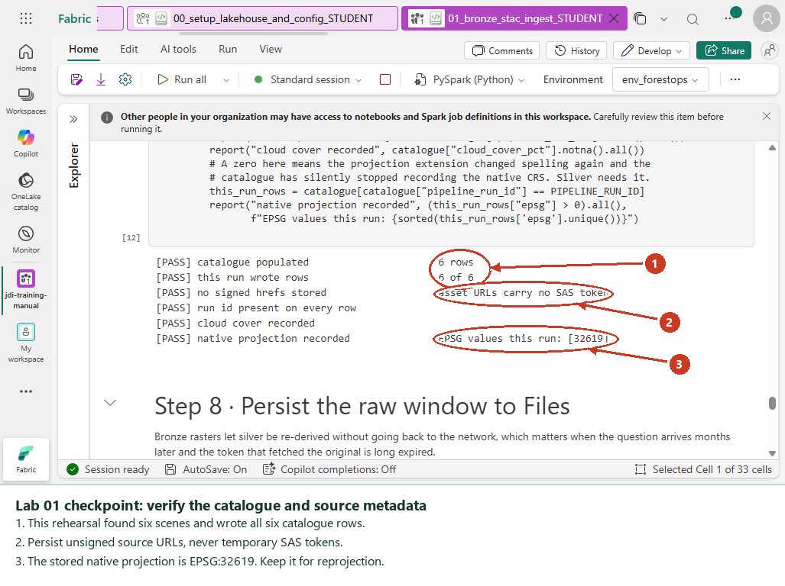

### Lab 02: Build Silver Observations

Exercise cells: **12, 14, 18, 20, 22, 27, 31 and 32**. Allow about 50 minutes.

1. Confirm Bronze tables and files from Labs 00 and 01 are available.
2. Complete SCL masking and reflectance scaling using the provided constants.
3. Reproject to EPSG:2953 and complete NDVI, NDMI, NBR and EVI.
4. Calculate zonal statistics by stand with explicit valid-pixel accounting.
5. Apply the 0.60 minimum valid-pixel fraction. Do not lower it to force a pass.
6. Write `silver_stand_observations` and inspect its unique stand/date grain.
7. Verify physical index ranges, source scene IDs and the quality gate. The
   manual-download rehearsal has 120 rows and 119 trusted stands. Your counts
   can differ; do not use historical counts as a substitute for validation.
8. Capture `07-lab-02.png` with the validation and coverage result.

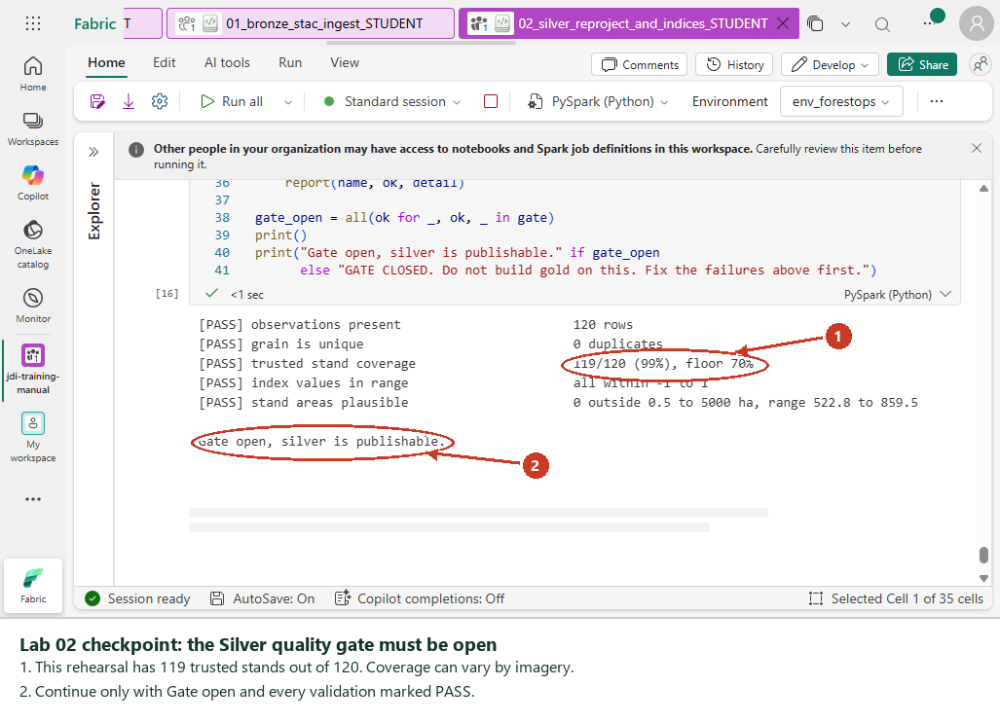

### Lab 03: Classify And Detect Change

Exercise cells: **6, 8, 12, 17 and 22**. Allow about 45 minutes.

1. Read Silver observations and build the period composite at stand grain.
2. Complete the provided threshold classification and confidence rules.
3. Complete change detection and review flags. Keep untrusted observations
   excluded according to the supplied gate.
4. Write `gold_stand_classification` and `gold_stand_change`.
5. Inspect class counts and the review queue. The manual-download rehearsal
   retains 119 stands. These are instructional spectral classes, not
   field-validated species or harvesting decisions.
6. Capture `08-lab-03.png` with the final validation and a classification preview.

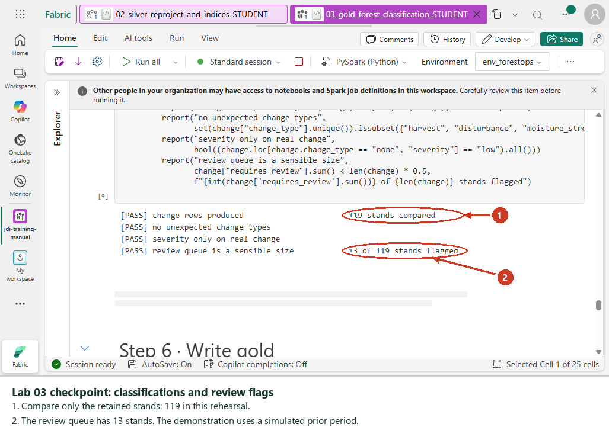

When no previous period is present, this lab constructs a simulated 2025
baseline for the change exercise. Harvest and disturbance flags from that
baseline are demonstration outputs, not observed historical events. Do not
describe the reference harvested-area number as a real harvest measurement.

### Lab 04: Add Guarded Narratives

Exercise cells: **9, 20, 26, 27 and 32**. Allow about 45 minutes.

1. Keep the offline path for the required lab. Do not configure Foundry
   credentials. Confirm the configuration output says **offline stub**.
2. Complete the structured payload with only allowed fields and explicit nulls.
3. Read the prompt restrictions: no calculations, invented numbers or operational
   decisions by the model.
4. Complete response parsing and numeric validation. Keep invalid narrative
   suppression and status fields intact.
5. Write `gold_stand_narrative` and inspect its `validation_status` values.
   The reference has 40 rows with status `stubbed`.
6. Capture `09-lab-04.png`, showing offline mode and the final validation.

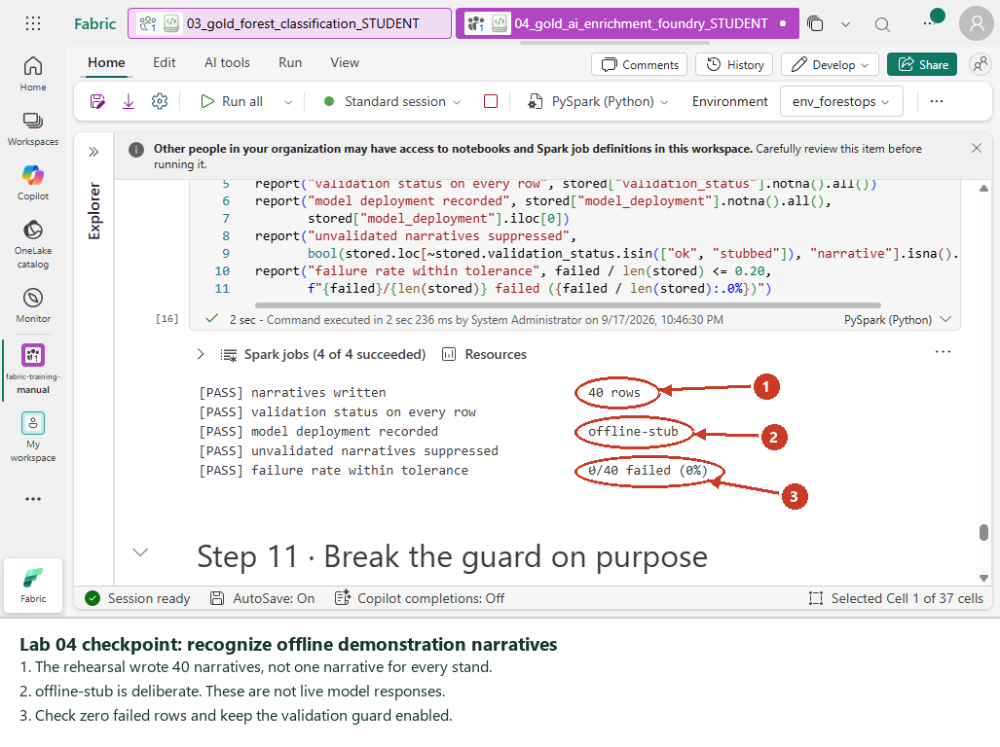

This notebook has no live-model client or credential setup. Do not describe
stubbed text as an AI model result. The native Fabric Data Agent comes later.

### Lab 05: Publish And Validate Gold Tables

Exercise cells: **6, 9 and 13**. Allow about 45 minutes for notebook work.

1. Build the stand dimension with WGS84 centroid coordinates and no binary
   geometry column in the model-facing table.
2. Build a contiguous daily date dimension covering the classification periods.
3. Review the seven-row class dimension, then complete the fact-table joins and
   date key at one row per stand and period.
4. Run key, null, relationship and range checks. Stop on any `[FAIL]`.
5. Write and inspect `gold_stand_facts`, `gold_dim_stand`, `gold_dim_date` and
   `gold_dim_forest_class`. This rehearsal has 119, 120, 365 and 7 rows.
6. Run **Publish the run summary**. Optional semantic-model, report and scheduling
   sections have been removed from the learner notebooks.
7. Run the supplied **Export the native Fabric Map layer** cell after completing
   the TODOs. It writes `Files/gold/maps/stand_classification.geojson`.
8. Confirm `readback: PASS` and that registered stands equal retained stands
   plus stands without a result. Note the exported reporting period.
9. Capture `10-lab-05.png`, including the Gold tables and export result.

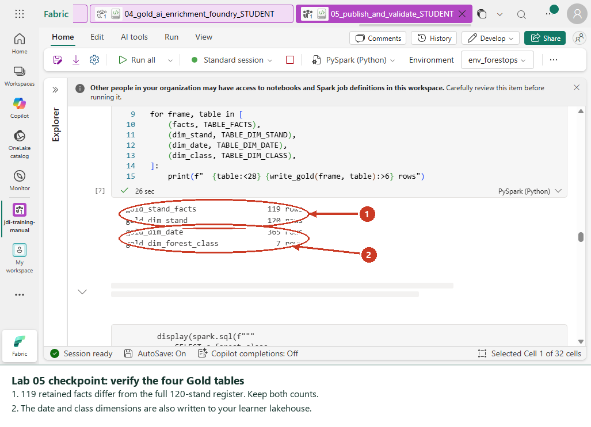

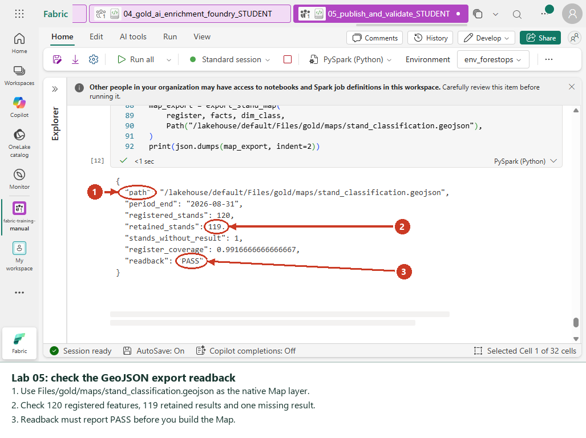

The export includes every registered polygon for one period. The
`no_classified_result` display category is different from the classifier's
`unclassified` class; missing quality/change attributes stay null. A new export
replaces the file snapshot, so refresh the Map after exporting again.

For example, 119 retained stands out of 120 registered stands is **99.17% register
coverage**, even when every retained fact is trusted. Report your own counts and
period. A semantic model, Power BI report and schedule are not required.

## 6. Check The SQL Endpoint

1. Open your lakehouse and switch to its **SQL analytics endpoint**.
2. Refresh Explorer and confirm the four Gold tables appear under **dbo**.
   New Delta tables can take time to synchronize; do not recreate them.
3. Select **New SQL query** and run this read-only check.

```sql
WITH latest_period AS (
    SELECT MAX(period_end) AS period_end FROM dbo.gold_stand_facts
), retained AS (
    SELECT facts.stand_id
    FROM dbo.gold_stand_facts AS facts
    CROSS JOIN latest_period
    WHERE facts.period_end = latest_period.period_end
)
SELECT (SELECT period_end FROM latest_period) AS period_end,
       COUNT(*) AS registered_stands,
       COUNT(retained.stand_id) AS retained_stands,
       COUNT(*) - COUNT(retained.stand_id) AS stands_without_result,
       CAST(100.0 * COUNT(retained.stand_id) / NULLIF(COUNT(*), 0)
            AS decimal(5, 2)) AS register_coverage_percent
FROM dbo.gold_dim_stand AS stands
LEFT JOIN retained ON stands.stand_id = retained.stand_id;
```

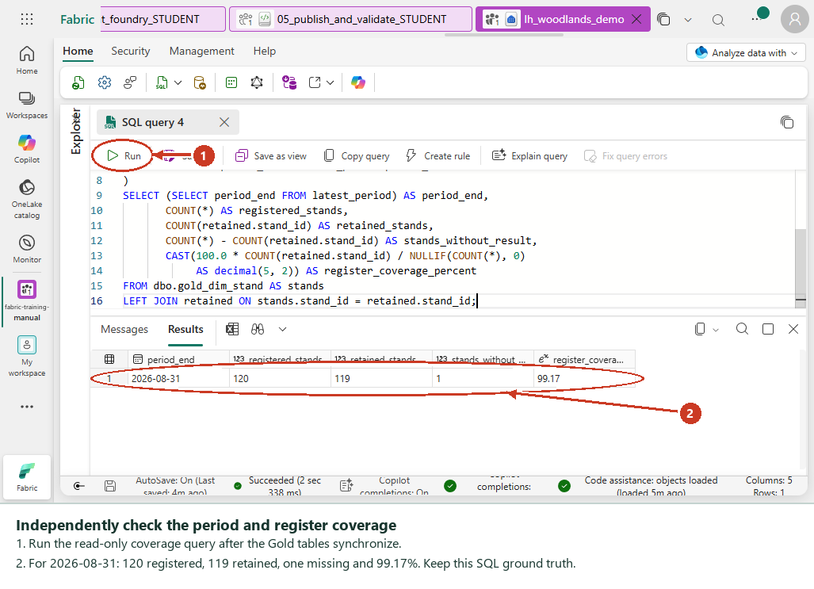

Checkpoint: these counts agree with the Lab 05 export. Save the SQL results
for testing your agent. If they disagree, check lakehouse selection and period.

## 7. Create A Native Fabric Map

Allow 20-30 minutes. This is a **Map item**, not a Power BI map visual.

### Create And Connect

1. Return to your learner folder and select **New item** > **All items** > **Map**.
2. Enter `map_woodlands_demo`, confirm the workspace, and select **Create**.
3. In Edit mode, open **Fabric items** > **Add** > **Lakehouse**.
4. Select your `lh_woodlands_demo` from the same workspace, then **Add**.
5. Expand **Files** > **gold** > **maps**, then select the **maps** folder to
   open the file pane. Open the context menu for `stand_classification.geojson`
   and select **Show on map**.
6. In the data layer menu, select **Zoom to fit**.

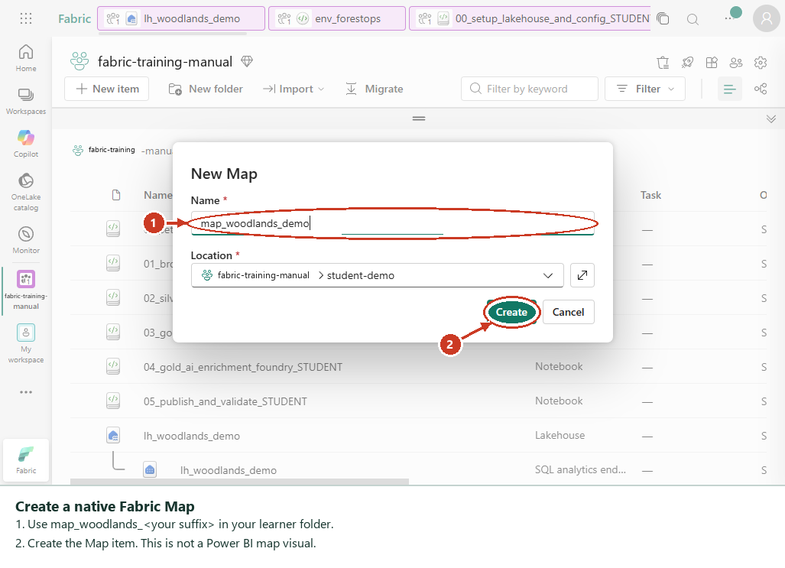

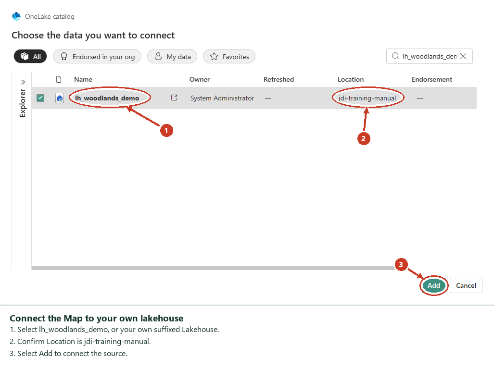

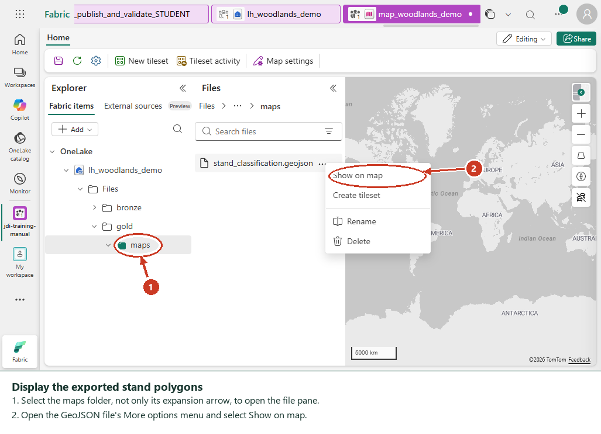

Checkpoint: stand polygons appear in central New Brunswick. Do not select a
Delta table or the notebook's single-band analytical rasters for this layer.

### Style And Inspect

1. Select the polygon layer and open **Layer settings**.
2. Turn on **Enable data-driven styling**.
3. Set **Color by** to `map_class` and **Style by** to **Category**.
4. Assign distinct colors to the categories present. Use the table below as a
   reference; selecting Category does not automatically use `colour_hex`.
5. Set **Fill opacity** to about 65% and keep **Enable extrusion** off.

| Category              | Color     |
|-----------------------|-----------|
| `softwood`            | `#1B7F4B` |
| `hardwood`            | `#C77A2B` |
| `mixedwood`           | `#7A9E3F` |
| `regenerating`        | `#9DD08A` |
| `recently_harvested`  | `#B5651D` |
| `non_forest`          | `#9AA5B1` |
| `unclassified`        | `#D9DEE4` |
| `no_classified_result` | `#61717D` |

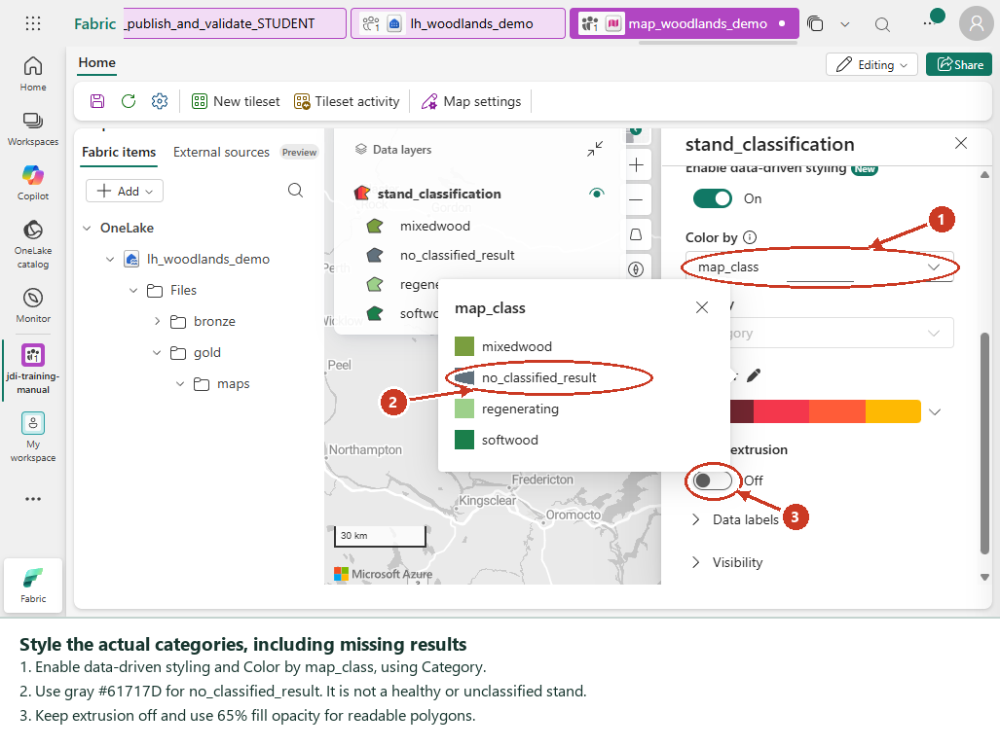

Continue with inspection and saving:

1. Under **Visibility** > **Tooltips**, select `stand_id`, `licence_block`,
   `period_end`, `map_class`, `area_ha`, `coverage_status`, `is_trusted`,
   `valid_pixel_fraction`, `requires_review` and `stand_source`.
2. Hover over a retained stand and a stand without a result. Inspect their
   properties without interpreting null as zero. Collapse the data-layer legend
   if it overlaps the tooltip.
3. Open the layer's **More options** > **Filter** > **Add filter** > **New filter**.
   Set **Field name** to `coverage_status`, select **no_classified_result**, and
   **Apply**. Inspect the missing-result stand, then **Remove filters** and close
   the filter editor. Confirm all categories and polygons return.
4. Hide and show the layer. Its polygons must disappear and return.
5. Use **Zoom to fit**, then **Map settings** > **Set initial view**. Check the
   New Brunswick center and a zoom that includes all stands. Close Map settings.
6. Select **Save** and wait for the successful-save notification. Return to
   the workspace and reopen the Map. Confirm the
   saved layer, colors and initial view are retained.

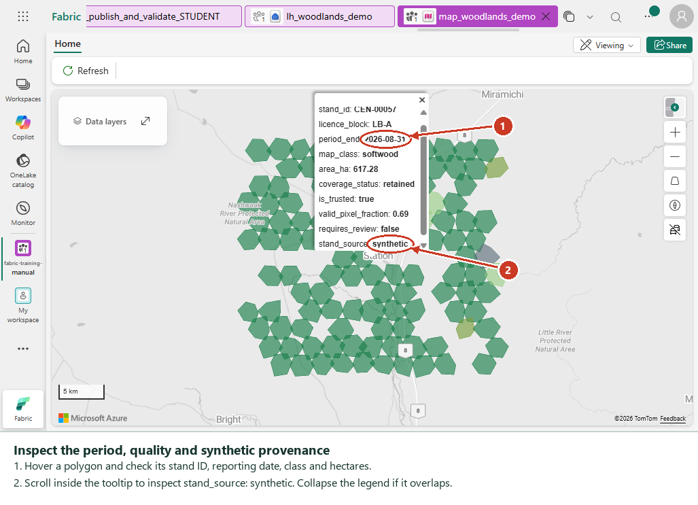

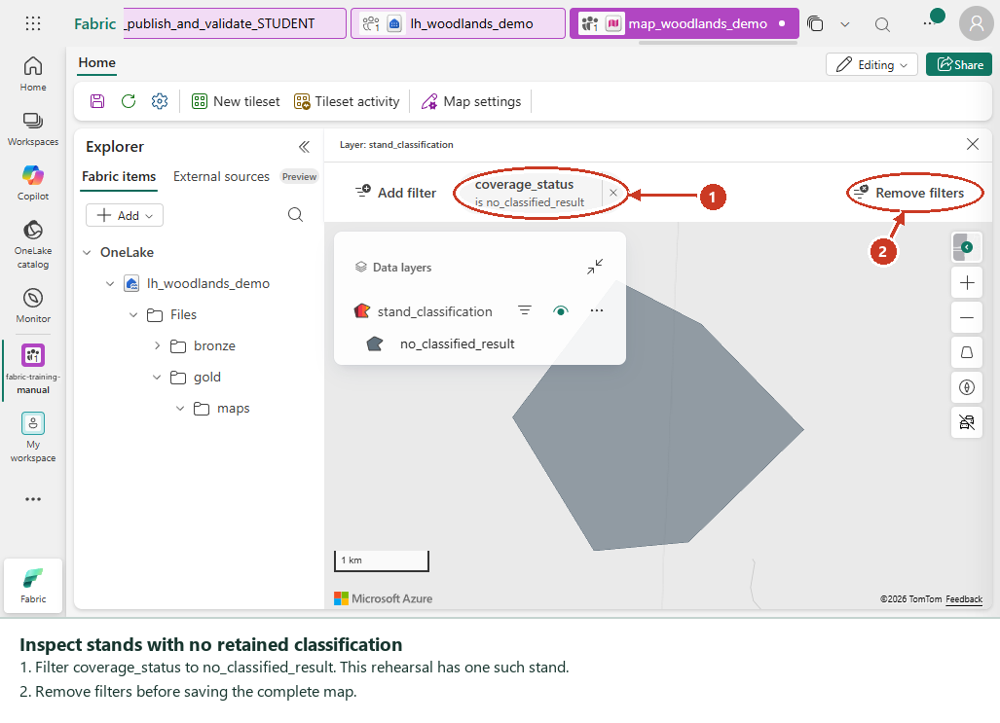

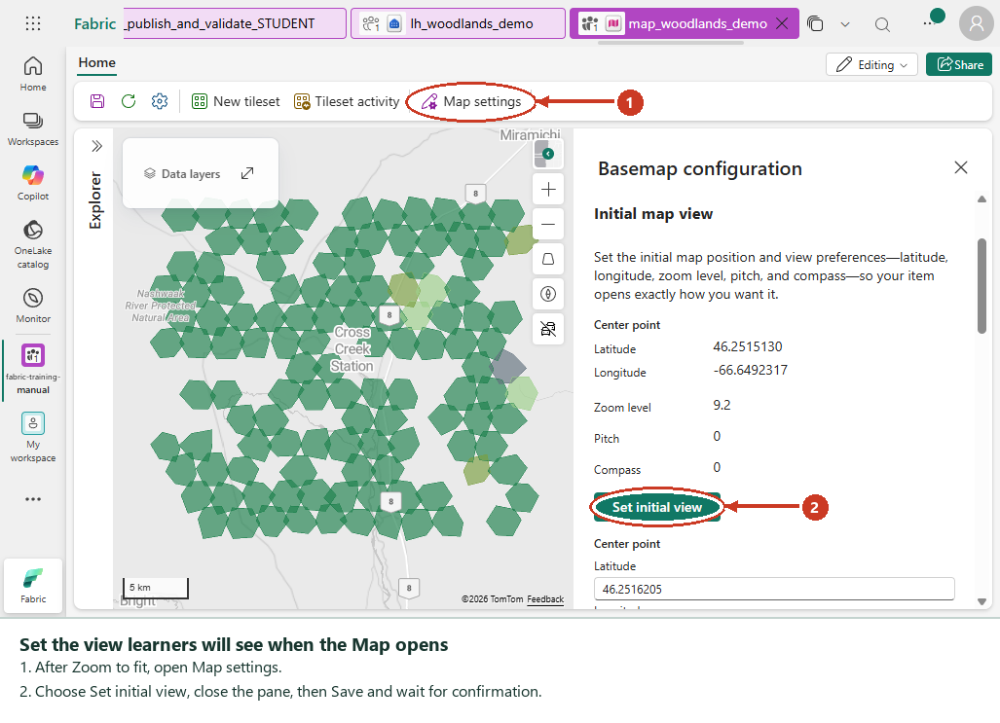

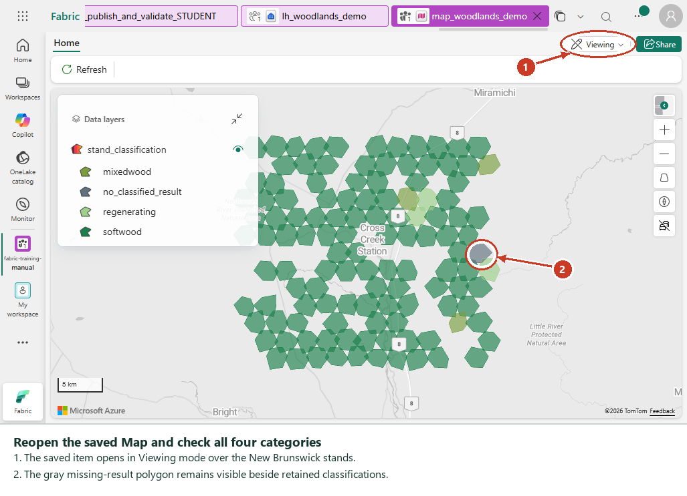

Checkpoint: the saved Map has real polygons, meaningful tooltips and visible
missing results where applicable. The legend lists categories present in this
period, not necessarily all seven classes. A built-in satellite or road basemap
is context, not the notebook's processed imagery.

## 8. Create A Fabric Data Agent

Allow 25-35 minutes. Use the native **Fabric data agent** item, not a custom
chatbot or Foundry agent. No Azure OpenAI key is required.

### Select The Gold Tables

1. Return to the workspace and select **New item**.
2. Open **All items**, select **Data agent**, and name it `agent_woodlands_demo`.
3. Skip the optional tour, then select **Add data** > **Data source**. In the
   OneLake catalog, select your `lh_woodlands_demo`, then **Add**.
4. In Explorer, select only `gold_stand_facts`, `gold_dim_stand`,
   `gold_dim_date` and `gold_dim_forest_class` under `dbo`.
5. Leave Bronze/Silver tables and run summaries unselected. If Gold tables
   are missing, check the SQL endpoint, then use the source's **Refresh** action.
   Do not choose a similarly named lakehouse from another workspace.

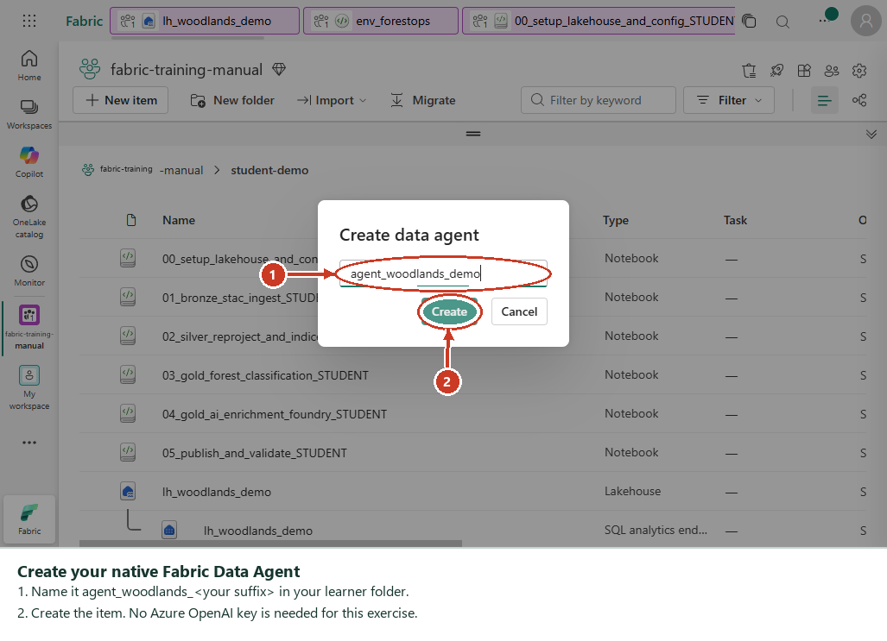

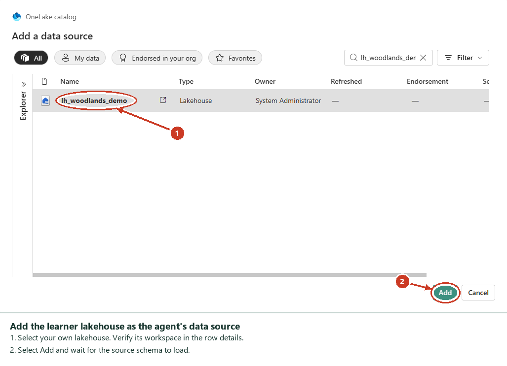

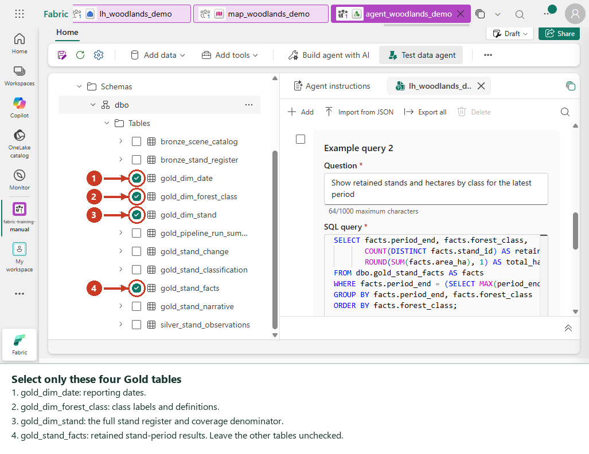

Drag the Explorer divider to the right if table names are truncated. Scroll
the table list to check all four selections before continuing.

### Add Instructions

Select **Setup** > **Agent instructions**, click the text to edit it, then
replace all starter text with the following:

```text
Answer only from the selected Woodlands training lakehouse tables.
These are synthetic boundaries and instructional spectral results,
not field-verified inventory or operational recommendations.

gold_dim_stand contains the full register. gold_stand_facts contains retained
stand-period results; its key is stand_id plus period_end. Unless a period
is supplied, use the maximum period_end in gold_stand_facts and state it.
Do not sum stand areas across multiple periods without an explicit request.

Join facts to gold_dim_stand on stand_id, gold_dim_date on date_key, and
gold_dim_forest_class on forest_class. Area is in hectares. Lat/lon are
WGS84 centroids. Never guess columns or calculate area from degrees.

Report registered, retained and missing-result stand counts separately.
Register coverage is retained distinct stand IDs for the selected period
divided by all stand IDs in gold_dim_stand. is_trusted describes a retained
fact, not whole-register coverage. A stand without a fact is not healthy,
zero-area, or the same as the forest_class value unclassified.

Use requires_review for the review queue. Zero rows is a valid result.
Lab 03 may use a simulated historical baseline: change flags are teaching
outputs, not proof of observed harvest or the cause of moisture stress.
Narratives with validation_status stubbed are offline examples, not live
model responses. A missing narrative does not mean missing stand data.

Use read-only queries. State period, units and relevant quality limitations.
Do not invent causes, missing results, external facts or forestry decisions.
```

Click the Markdown preview to save. Reopen the instructions and confirm that
the complete text is present once, without the original starter instructions.

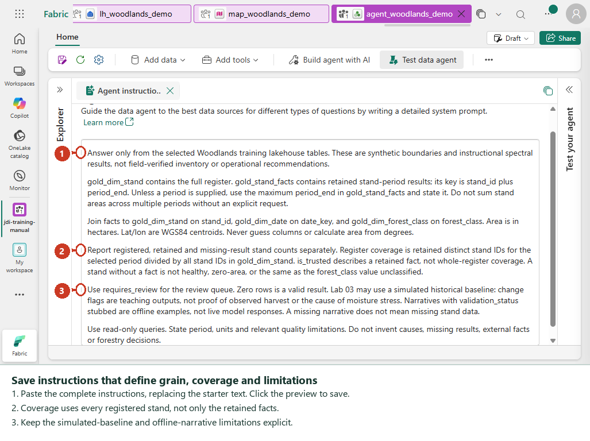

### Add Validated Examples

1. Under **Setup** > **lh_woodlands_demo**, select **Example queries** > **Add**.
2. Add **How many registered stands have a result in the latest period, and
   what is register coverage?** with the SQL from Step 6.
3. Add **Show retained stands and hectares by class for the latest period** with:

```sql
SELECT facts.period_end, facts.forest_class,
       COUNT(DISTINCT facts.stand_id) AS retained_stands,
       ROUND(SUM(facts.area_ha), 1) AS total_ha
FROM dbo.gold_stand_facts AS facts
WHERE facts.period_end = (SELECT MAX(period_end) FROM dbo.gold_stand_facts)
GROUP BY facts.period_end, facts.forest_class
ORDER BY facts.forest_class;
```

Add **Which stands require review in the latest period?** with:

```sql
SELECT TOP (20) facts.stand_id, stands.licence_block,
       facts.period_end, facts.forest_class, facts.change_type,
       facts.severity, ROUND(facts.area_ha, 1) AS area_ha,
       facts.validation_status
FROM dbo.gold_stand_facts AS facts
JOIN dbo.gold_dim_stand AS stands ON stands.stand_id = facts.stand_id
WHERE facts.period_end = (SELECT MAX(period_end) FROM dbo.gold_stand_facts)
  AND facts.requires_review = 1
ORDER BY facts.severity DESC, facts.area_ha DESC, facts.stand_id;
```

1. Enter each question, click outside and wait for saving to finish. Then select
   all the SQL placeholder text and paste the query. Click outside again.
2. Wait for automatic validation to finish without an error. Controls can be
   briefly read-only during saving; wait instead of pasting twice. Reopen the
   examples and confirm all three question/query pairs were saved correctly.
3. Run the same SQL independently in the SQL analytics endpoint and retain its
   results as ground truth for the agent answers.

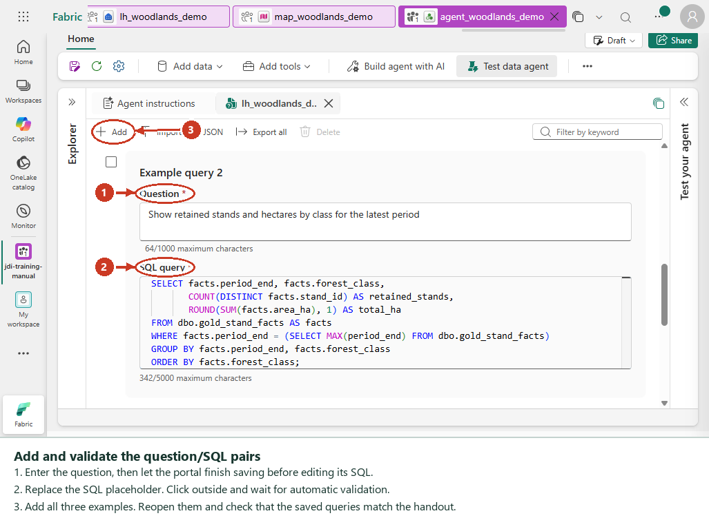

### Test And Publish

Ask these questions. Expand each answer's intermediate steps and inspect the
generated SQL and selected source. Close configuration tabs and collapse
Explorer for a wider response pane. Use **Expand response** > **Steps completed**
when the answer is long. Distinguish a fraction such as 0.9917 from 99.17%.

| Question                                                      | Check                                              |
|---------------------------------------------------------------|----------------------------------------------------|
| How many stands are registered?                                | Count of `gold_dim_stand`                           |
| Show latest-period stand counts and hectares by forest class.   | Class query above, one stated period                |
| How many stands lack a result in the latest period, and what is register coverage? State the reporting period as a date. | Step 6 SQL, not retained-fact trust percentage |
| Which stands need review in the latest period?                 | Review query above, including an empty result       |
| Are narratives live model results and changes observed events? | Stub status and simulated-baseline limitations      |

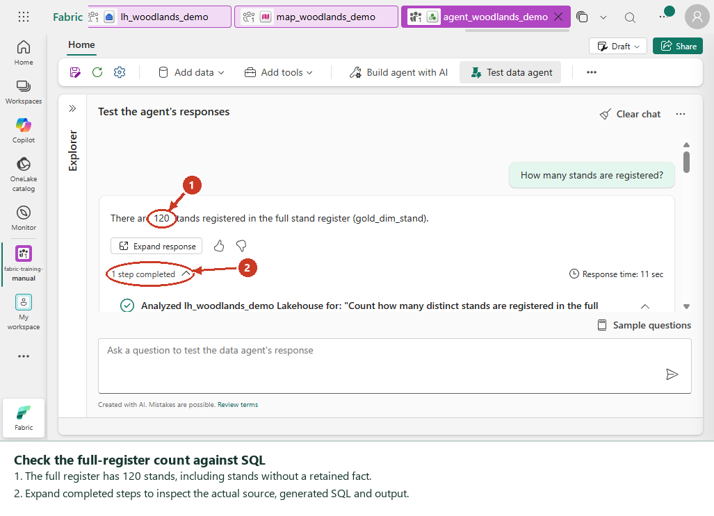

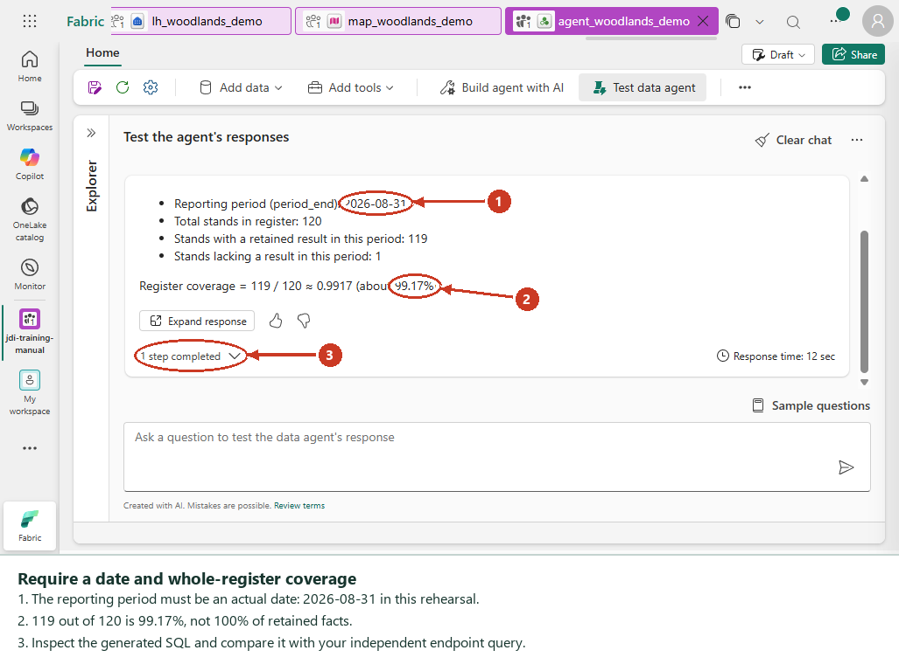

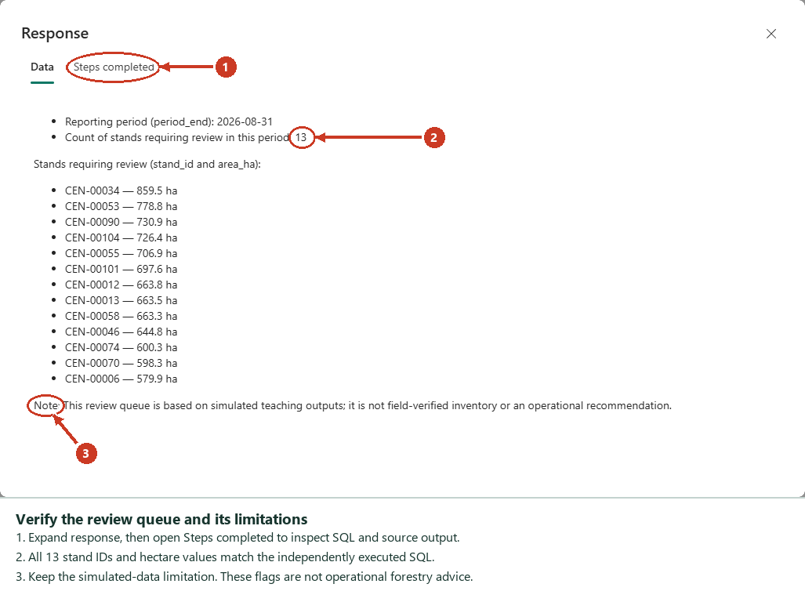

If an answer disagrees with SQL, correct instructions/examples and test again.
Do not publish a wrong count, duplicated area total or invented cause.

1. After the tests pass, select **More items (...)** > **Publish** in the ribbon.
2. Enter: **Answers read-only questions about synthetic Woodlands training
   stands, latest-period classification, coverage and review flags. Includes
   demonstration data limitations.**
3. Leave **Also publish to Microsoft 365 Copilot** off, then select **Publish**.
4. Wait for completion, return to the workspace and reopen the agent.
5. Open the **Draft** menu and select **Published**. Repeat the coverage question
   and confirm that the date and counts still agree with Step 6.
6. Do not grant external access for this exercise. Agent access does not replace
   permission to read its underlying data.

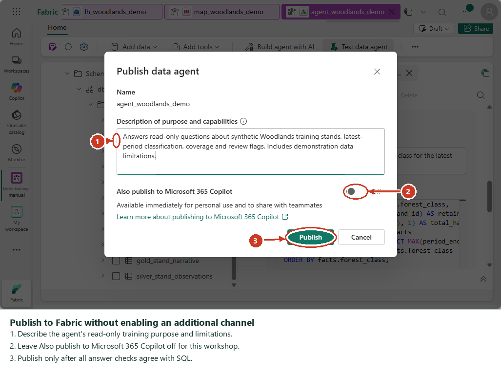

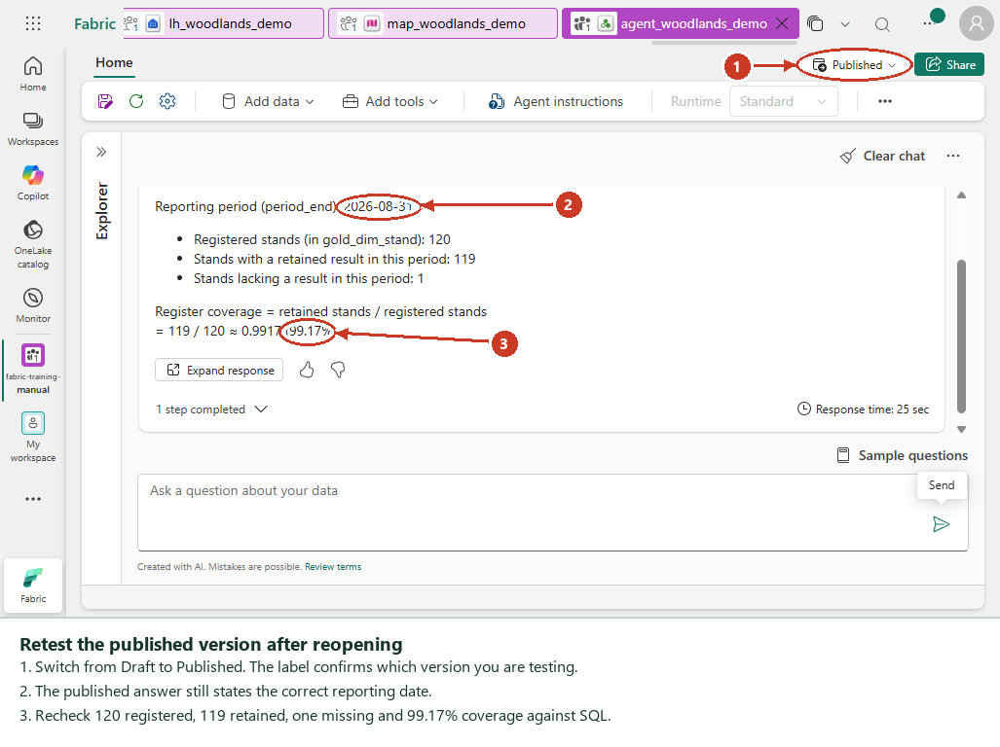

Checkpoint: the published Data Agent returns the correct period, units and
SQL-backed answers, including quality and demonstration-data limitations.

## 9. Finish And Hand In

1. Confirm the six notebooks, your lakehouse, Map and Data Agent exist.
2. Submit links to your notebook folder, lakehouse, Map and published agent.
3. Include six lab checkpoint images, a Map tooltip/filter result, an agent
   coverage answer and the matching SQL output.
4. State your reporting period and registered/retained/missing counts. Explain
   the synthetic register, simulated baseline and offline narratives.
5. Stop your Spark sessions. Do not pause the shared capacity or enable a schedule.

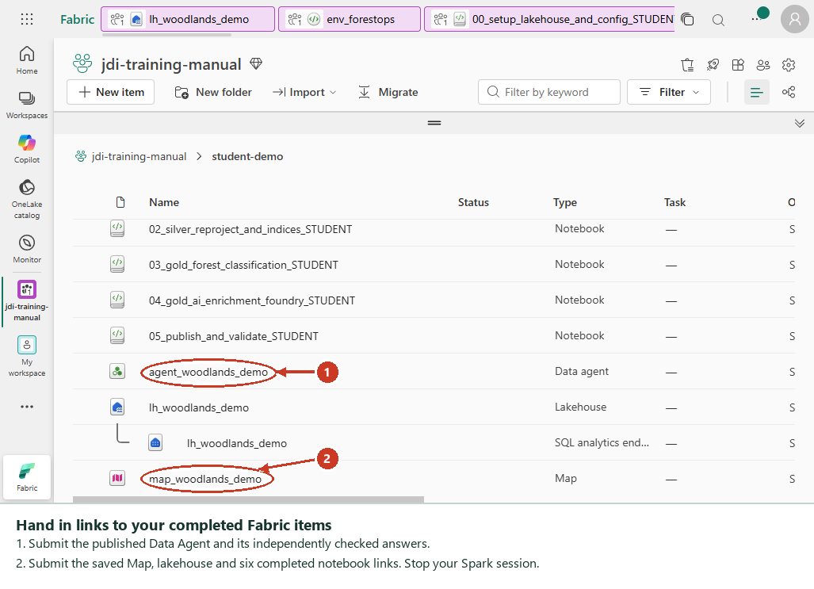

Use a local `evidence/<your-name>` folder for your own checkpoint captures.
Exclude account menus, secrets, connection strings and signed imagery URLs.
Take a second close-up when the title and result do not fit legibly together.

## Troubleshooting

| Symptom                         | Action                                                  |
|---------------------------------|---------------------------------------------------------|
| Import option unavailable       | Verify workspace role and selected folder               |
| Duplicate notebook name         | Cancel overwrite; use a participant suffix               |
| Missing geospatial package      | Attach published env_forestops, then restart session     |
| Environment list has duplicates | Select the row whose Location is jdi-training-manual     |
| Missing Bronze table or file    | Check default lakehouse and upstream lab completion     |
| STAC timeout, 429 or empty data  | Retain outputs; ask facilitator about source availability |
| FAIL printed but cell succeeded | Stop and correct the exercise; do not trust job status alone |
| Known item returns 404          | Ask facilitator to confirm capacity is active           |
| Fewer classified stands         | Inspect quality exclusions; do not weaken the gate      |
| Map has no polygons             | Verify GeoJSON, Show on map, layer visibility and Zoom to fit |
| Map background is blank         | Ask the admin to check Azure Maps tenant settings       |
| Agent tables are missing        | Check SQL synchronization, then refresh source metadata |
| Agent reports 100% coverage     | Use the full stand dimension as the denominator         |
| Agent is unavailable            | Check paid capacity, permissions and approved AI settings |

## Completion Checklist

* [ ] Six student notebooks are in your folder, numbered 00 through 05.
* [ ] Each uses PySpark, env_forestops and my own default learner lakehouse.
* [ ] All exercises are complete and no failed check is ignored.
* [ ] Bronze, Silver and Gold outputs meet the documented contracts.
* [ ] Excluded stands and offline narratives remain visible in your explanation.
* [ ] Your evidence folder includes the setup, attachment and six checkpoint images.
* [ ] GeoJSON readback passes and preserves stands without results.
* [ ] Your native Fabric Map saves, reopens and displays the correct polygons.
* [ ] Your published Data Agent answers match independent SQL results.
* [ ] You stopped any learner Spark session when finished and returned the execution slot.
* [ ] No notebook or screenshot contains a credential.

## Facilitator Workspace Preparation

Do this once before class. You need workspace-creation and capacity-assignment
permissions. Students start at Step 1 after this preparation.

1. Sign in to Contoso. Verify the directory without recording account menus.
2. Confirm `rayfintestenv` is active and remains F64. If paused, obtain owner
   approval before resuming; do not create a replacement capacity.
3. Select **Workspaces** > **New workspace** and enter `jdi-training-manual`.
4. In the license/capacity section, choose the existing `rayfintestenv` Fabric
   capacity, then create the workspace.
5. Open **Workspace settings** and verify the capacity assignment. Preserve
   the older `jdi-training` reference workspace and its items.
6. Provide approved learners Contributor access through your normal access
   process. Do not create public links or change tenant-wide sharing policies.
7. Complete [manual Environment setup](12-spark-environment.md#manual-portal-setup).
8. Verify Planetary Computer STAC, signing and imagery endpoints are reachable
   from the approved Fabric network configuration.
9. Confirm **Map** and **Fabric data agent** are available. Have the admin
   review [Maps settings](https://learn.microsoft.com/fabric/admin/map-settings)
   and [Data Agent settings](https://learn.microsoft.com/fabric/data-science/data-agent-tenant-settings).
   Do not enable cross-region processing or relax outbound protection without approval.
10. Stagger Spark starts and imagery ingestion. Separate lakehouses prevent
    write collisions but still share the F64's compute capacity.

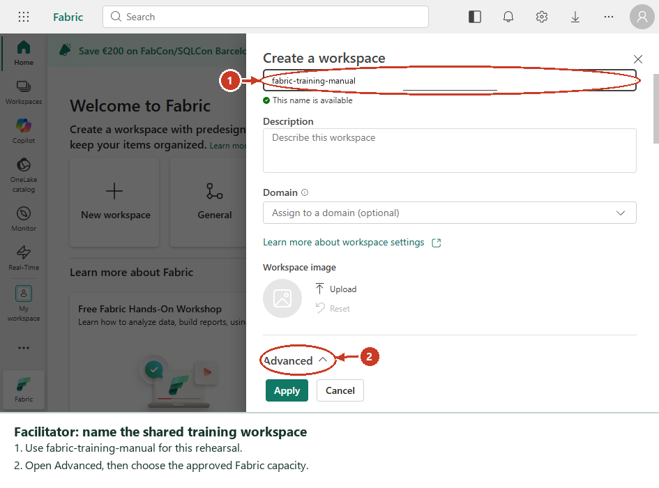

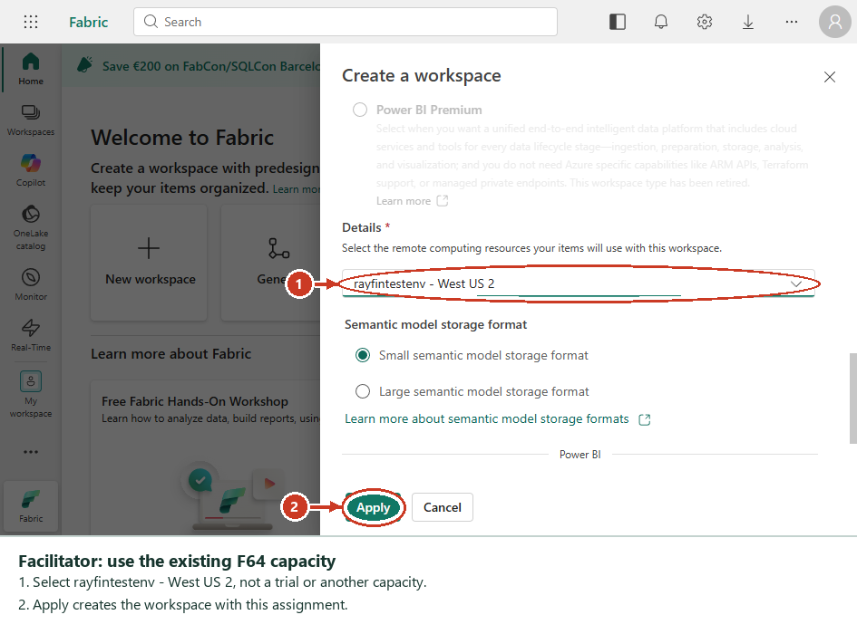

## References

* [Create a Fabric Map](https://learn.microsoft.com/fabric/real-time-intelligence/map/create-map)
* [Add lakehouse layers](https://learn.microsoft.com/fabric/real-time-intelligence/map/add-lakehouse-layer)
* [Customize map layers](https://learn.microsoft.com/fabric/real-time-intelligence/map/customize-map)
* [Create a Fabric Data Agent](https://learn.microsoft.com/fabric/data-science/how-to-create-data-agent)
* [Lakehouse schemas](https://learn.microsoft.com/fabric/data-engineering/lakehouse-schemas)
