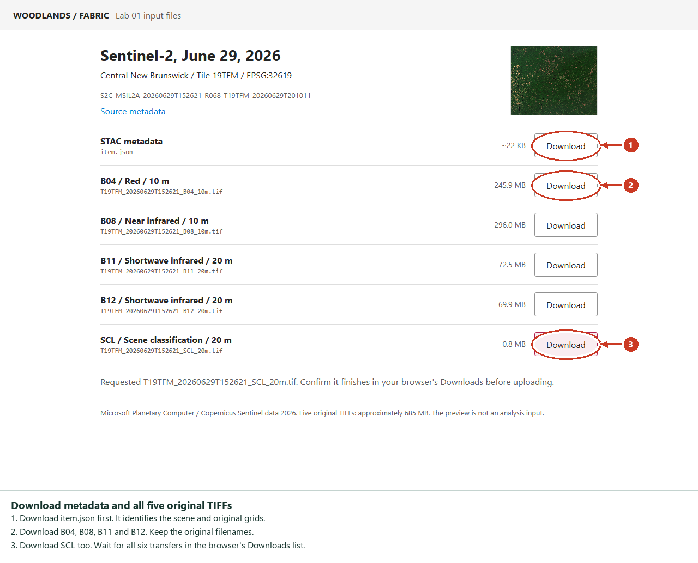
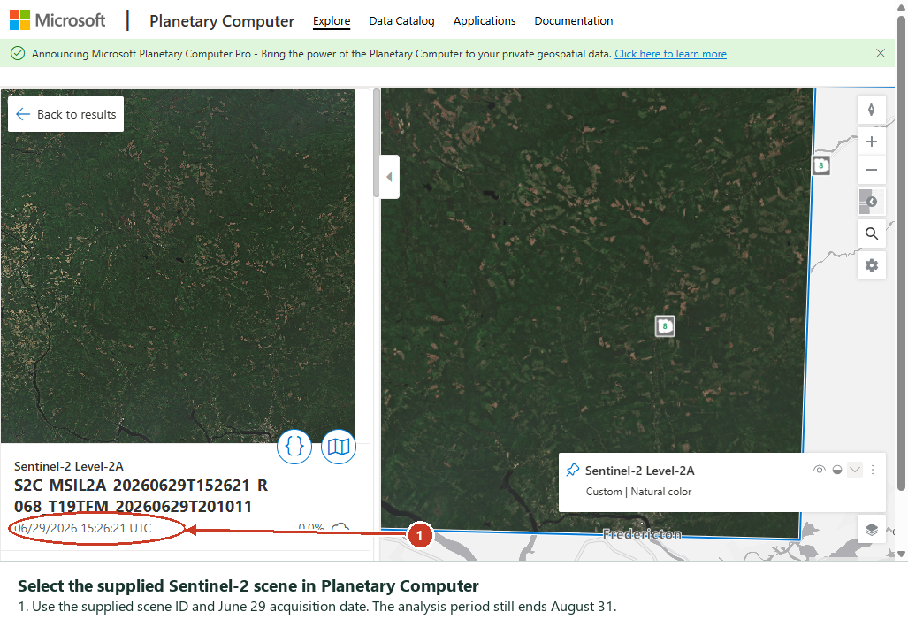
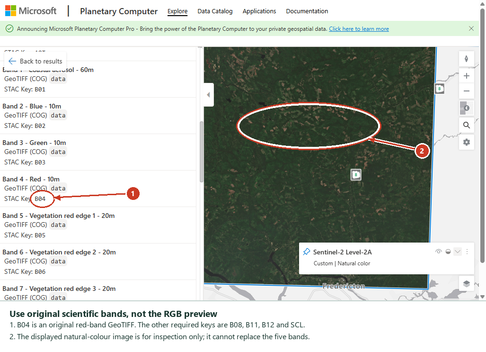
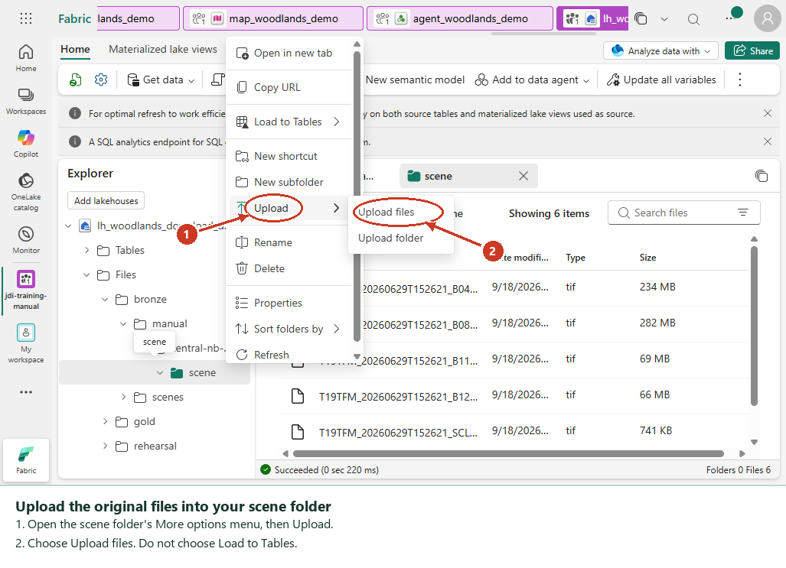
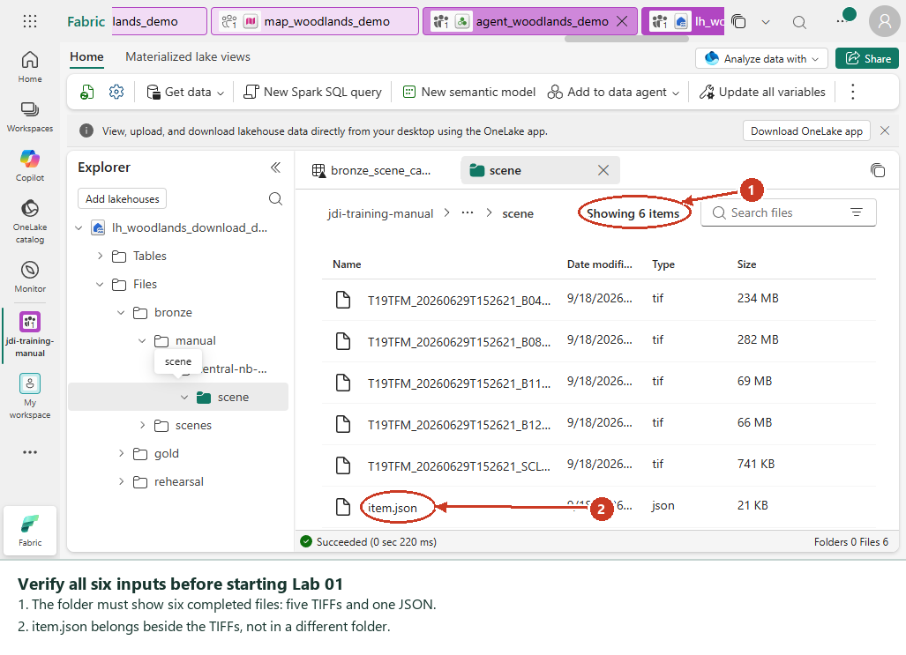

## Choose Your Route

Complete the notebook imports, lakehouse creation and Environment attachment in
the [student guide](student-guide.md) first. Complete Lab 00 before Lab 01.

| Route | Lab 01 setting | What you need |
|---|---|---|
| Manual download and upload, the default | `INPUT_MODE = "manual"` | Six downloaded files in your lakehouse Files area |
| Automatic catalogue search | `INPUT_MODE = "stac"` | Outbound access from Fabric to Planetary Computer and its imagery storage |

Both routes use the same Silver, Gold, Map and Data Agent steps. Choose one
route per run. Lab 02 never silently switches to an online download.

## 1. Download The Six Files

1. Extract the workshop ZIP. Open **handouts/download-imagery.html** in Edge or
   Chrome, or open the repository's [download handout](download-imagery.html).
   A source-code preview in GitHub is not the working page; use the extracted file.
2. Wait for **Ready: item.json and five original TIFFs**. The source is the public
   Microsoft Planetary Computer, not a file server hosted by this workshop.
3. Select **Download** for `item.json`, then for each of `B04`, `B08`, `B11`,
   `B12` and `SCL`. Download one file at a time if your browser asks permission.
4. Check the browser's Downloads list. Wait until all six files have completed.
   The handout's **Requested** message means the transfer started, not finished.
5. Put the six completed files in one local folder named `scene`. Keep the TIFF
   filenames unchanged. If the browser adds `(1)`, remove that suffix from your
   chosen copy. Do not upload partial `.crdownload` files.

Allow approximately **685 MB** for the TIFF download and the same amount for
upload. Keep at least 1 GB free locally. The imagery is not bundled in the ZIP.
No local Python, Azure key, Foundry account or software installation is needed.



The supplied scene is acquired **June 29, 2026**, tile **19TFM**, native
**EPSG:32619**. Its scene-wide cloud cover is about **0.01%**. It intersects the
supplied New Brunswick area and falls within the June-August analysis window.

| Required file | Size, approximately | Purpose |
|---|---|---|
| `item.json` | 22 KB | Scene ID, acquisition time, projection and original asset metadata |
| `T19TFM_20260629T152621_B04_10m.tif` | 245.9 MB | Red |
| `T19TFM_20260629T152621_B08_10m.tif` | 296.0 MB | Near infrared |
| `T19TFM_20260629T152621_B11_20m.tif` | 72.5 MB | Shortwave infrared |
| `T19TFM_20260629T152621_B12_20m.tif` | 69.9 MB | Shortwave infrared |
| `T19TFM_20260629T152621_SCL_20m.tif` | 0.8 MB | Cloud, shadow, snow and nodata classes |

> [!IMPORTANT]
> A screenshot, JPG, PNG, rendered preview or RGB-only image cannot substitute
> for these scientific bands. Do not resize, crop, recolour or combine the TIFFs.
> A single Sentinel-2 scene consists of several band files; all five are required.

### Inspect The Scene In Explorer

Open [Planetary Computer Explorer](https://planetarycomputer.microsoft.com/explore?c=-66.65%2C46.25&z=8.50&v=2&d=sentinel-2-l2a).
Choose **Sentinel-2 Level-2A**, select **Advanced**, then add the **Item ID** filter.
Use **Equals** and paste this exact value:

```text
S2C_MSIL2A_20260629T152621_R068_T19TFM_20260629T201011
```

Keep the map over central New Brunswick. Select the matching result. **Metadata**
shows the acquisition date and EPSG code; **Assets** lists each STAC band key.
The Explorer asset list is descriptive, not a direct-download menu. Use the
download handout for the original files.





## 2. Upload Into Your Lakehouse

1. Open your own lakehouse in Fabric, for example `lh_woodlands_demo`.
2. Under **Files**, create and open these nested folders:
   `bronze` > `manual` > `central-nb-block-a` > `scene`.
3. Select the **scene** folder name to open its file list. Open that folder's
   **More options** (`...`) menu, then **Upload** > **Upload files**.
4. Add `item.json` and all five TIFFs. Select **Upload** and wait for each transfer
   to finish. Refresh the folder and verify all six filenames and nonzero sizes.
5. Keep them in **Files**. Do not choose **Load to Tables** for raster files.





The screenshots use the isolated verification lakehouse
`lh_woodlands_download_demo`; use your own learner lakehouse. Fabric can display
binary file sizes under an MB label, so its displayed sizes can be smaller than
the decimal MB values in the download table.

The resulting layout must be:

```text
Files/
  bronze/
    manual/
      central-nb-block-a/
        scene/
          item.json
          T19TFM_20260629T152621_B04_10m.tif
          T19TFM_20260629T152621_B08_10m.tif
          T19TFM_20260629T152621_B11_20m.tif
          T19TFM_20260629T152621_B12_20m.tif
          T19TFM_20260629T152621_SCL_20m.tif
```

## 3. Run Lab 01 In Manual Mode

1. Open Lab 01. Confirm `env_forestops` and your own **default** lakehouse.
2. In **Cell 6**, leave these settings unchanged:

   ```python
   INPUT_MODE = "manual"
   MANUAL_SCENE_ROOT = f"/lakehouse/default/Files/bronze/manual/{AOI_NAME}"
   ```

3. Run **Cell 9**. Its file-validation helper is supplied. The catalogue-opening
   TODO applies only to `stac` mode and does not execute in manual mode.
4. Run **Cell 11**. The search-function TODO is also automatic-mode-only. Manual
   mode checks your uploaded metadata and TIFFs, then selects the local scene.
5. Complete the shared exercises in **Cells 17, 24, 26 and 30**. Run every
   intervening validation and the final cache-writing cell in order.
6. Verify one catalogue row for this run, five output TIFFs, and
   `Files/bronze/scenes/central-nb-block-a/_session_cache.zarr`.
7. Continue Labs 02-05. Lab 02 must print **Input route: manual** and the real
   source scene ID. Stop on any error or `[FAIL]`.

The manual rehearsal passed all six labs on Runtime 1.3. It produced 120 Silver
rows, 119 retained Gold facts, 40 offline narratives and 120 exported polygons.
The reporting period ends August 31 even though this route uses one June scene.
One scene is sufficient for the teaching exercise, not a representative seasonal
inventory. Change flags still use the explicitly simulated previous-year baseline.

## Automatic Alternative

Leave the manual files untouched. Set only `INPUT_MODE = "stac"` in Lab 01
Cell 6, complete the catalogue and search TODOs in Cells 9 and 11, then complete
the shared exercises. The same six-scene limit, area, dates and cloud threshold
apply. Finish the final cache write before running Silver.

Selecting the automatic route replaces the working imagery cache for that area;
it does not delete the original manual-upload files. Never run the two routes
concurrently against the same lakehouse. Create separate learner lakehouses for
side-by-side comparisons.

## Troubleshooting

| Message or symptom | Action |
|---|---|
| Download page cannot connect | Select **Retry connection**. Confirm public Planetary Computer access is allowed. |
| Download page is blocked by browser policy | Use the signing-link fallback below, or ask the facilitator to distribute the verified original files through an approved channel. |
| Missing `item.json` or a band | Check the exact Files path and filenames, including `.json` rather than `.json.txt`. |
| Grid, dimensions or CRS do not match | Download all files from the same scene. Do not use a rendered or cropped export. |
| Scene outside area/date/cloud limit | Use the supplied scene, or deliberately align all labs to a different approved area and period. |
| Bronze imagery missing in Lab 02 | Confirm the same default lakehouse and rerun Lab 01's final cache write. Silver never downloads replacement imagery. |
| Quality gate closed | Inspect SCL/cloud coverage. Do not lower the quality threshold to force a pass. |

### Signing-Link Fallback

Open the [unsigned STAC Item JSON](https://planetarycomputer.microsoft.com/api/stac/v1/collections/sentinel-2-l2a/items/S2C_MSIL2A_20260629T152621_R068_T19TFM_20260629T201011)
and save it as `item.json`. For each required band's `assets` entry, copy its
unsigned `href`. Open the official
[Planetary Computer SAS API documentation](https://planetarycomputer.microsoft.com/docs/reference/sas/)
and use its **sign** operation for that URL. Open the returned temporary `href`
in your browser to download the original TIFF. Keep the original filename.
Do not put the signed URL in your notebook, metadata file, screenshot or report.

## Continue The Workshop

Return to [Lab 02 in the student guide](student-guide.md#lab-02-build-silver-observations).
Create the native Fabric Map and Data Agent after Lab 05. Their inputs and steps
are unchanged by the imagery route.
