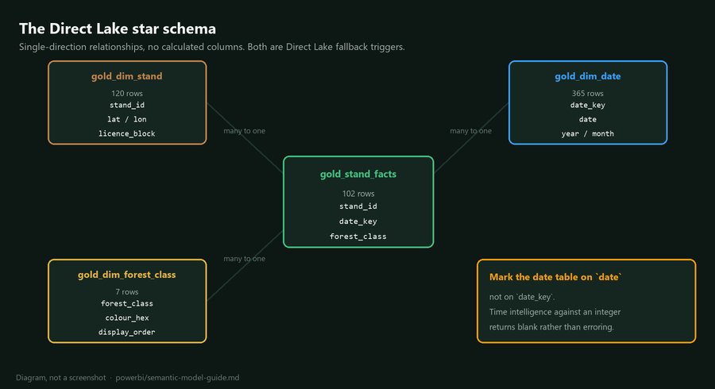

## Direct Lake semantic model build guide

This is the Session 2, Step 4 build. It assumes notebook 05 has run and the four
gold tables exist. Every column named here was read from the tables the pipeline
actually produced, not from a design document.

## Before you start

Confirm the four tables are present in `lh_gold`:

| Table | Grain | Rows in the reference run |
|---|---|---|
| `gold_stand_facts` | one row per stand per period | 102 |
| `gold_dim_stand` | one row per stand | 120 |
| `gold_dim_date` | one row per day, contiguous | full calendar years |
| `gold_dim_forest_class` | one row per class | 7 |

The fact table has fewer rows than the stand dimension on purpose. Stands whose
`valid_pixel_fraction` fell below 0.60 were excluded from classification because
too much of the canopy was cloud. That is the pipeline working, not a join
problem, and the next section explains how to show it honestly in the report.

## Create the model

1. Open the `jdi-mock-training-gold` workspace.
2. Open `lh_gold`, then use **New semantic model** from the Lakehouse ribbon.
3. Select `gold_stand_facts`, `gold_dim_stand`, `gold_dim_date` and
   `gold_dim_forest_class`. Nothing else.
4. Name it `sm_forest_condition`.

Selecting only four tables is deliberate. Adding
`gold_stand_classification`, `gold_stand_change` and `gold_stand_narrative`
gives you three more paths between the same entities, and ambiguous relationship
paths are the most common cause of a measure that returns a number nobody can
explain. Everything from those tables is already denormalised into the fact.

## Relationships



Set these three, all many to one, all single direction:

| From | To | Cardinality | Cross filter |
|---|---|---|---|
| `gold_stand_facts[stand_id]` | `gold_dim_stand[stand_id]` | many to one | single |
| `gold_stand_facts[date_key]` | `gold_dim_date[date_key]` | many to one | single |
| `gold_stand_facts[forest_class]` | `gold_dim_forest_class[forest_class]` | many to one | single |

Then mark `gold_dim_date` as the date table, using the `date` column rather
than `date_key`. Time intelligence functions will not work against an integer
key, and the failure is silent: `DATEADD` simply returns blank.

Leave every relationship single direction. Bidirectional filtering is one of the
documented triggers for a Direct Lake fallback to DirectQuery, and on a model
this small it buys nothing.

## Measures

Create these in `gold_stand_facts`. They are written against the real column
names, so they can be pasted directly.

```dax
Stand count = DISTINCTCOUNT ( gold_stand_facts[stand_id] )
```

```dax
Total area ha =
SUM ( gold_stand_facts[area_ha] )
```

```dax
-- Only stands with enough clear pixels to be worth reporting. Every area
-- measure in the report should use this rather than the raw sum, otherwise
-- cloudy months look like forest loss.
Trusted area ha =
CALCULATE (
    SUM ( gold_stand_facts[area_ha] ),
    gold_stand_facts[is_trusted] = TRUE ()
)
```

```dax
Harvested area ha =
CALCULATE (
    SUM ( gold_stand_facts[area_ha] ),
    gold_stand_facts[change_type] = "harvest"
)
```

```dax
-- Moisture stress is a low NDMI on a stand we actually trust. The valid pixel
-- guard matters here more than anywhere: thin cirrus depresses NDMI, so an
-- untrusted stand reads as stressed when it is merely obscured.
Moisture stress stands =
CALCULATE (
    DISTINCTCOUNT ( gold_stand_facts[stand_id] ),
    gold_stand_facts[ndmi_mean] < 0.15,
    gold_stand_facts[is_trusted] = TRUE ()
)
```

```dax
Stands needing review =
CALCULATE (
    DISTINCTCOUNT ( gold_stand_facts[stand_id] ),
    gold_stand_facts[requires_review] = TRUE ()
)
```

```dax
-- Coverage is the honesty measure. Put it on the page so a reader can see how
-- much of the licence area this month's answer is actually based on.
Coverage pct =
DIVIDE (
    CALCULATE ( DISTINCTCOUNT ( gold_stand_facts[stand_id] ),
                gold_stand_facts[is_trusted] = TRUE () ),
    DISTINCTCOUNT ( gold_dim_stand[stand_id] )
)
```

```dax
-- Narratives are suppressed rather than dropped when the numeric guard fails,
-- so a count of unverified rows belongs on the page too.
Narratives withheld =
CALCULATE (
    COUNTROWS ( gold_stand_facts ),
    gold_stand_facts[validation_status] <> "ok"
)
```

Notice that none of these are calculated columns. Every one is a measure.
A calculated column is evaluated per row at model load, which Direct Lake cannot
serve from parquet, so adding one drops the whole model back to DirectQuery. If
you need a new column, add it in notebook 05 where it is testable and version
controlled.

## The report page

Build one page that answers the problem statement from the start of Session 2.

1. **Map by class.** Map visual, `gold_dim_stand[lat]` and
   `gold_dim_stand[lon]` as latitude and longitude, `Trusted area ha` as size,
   `gold_dim_forest_class[forest_class]` as legend. Set the legend colours from
   `colour_hex` so the map matches the rest of the report.
2. **Trend by month.** Line chart, `gold_dim_date[month_name]` on the axis,
   `Harvested area ha` and `Moisture stress stands` as values.
3. **Class breakdown.** Bar chart sorted by
   `gold_dim_forest_class[display_order]`, not by value, so the order is stable
   between months.
4. **Review queue.** Table filtered to `requires_review = TRUE`, showing
   `stand_id`, `licence_block`, `change_type`, `severity` and `narrative`.
5. **Coverage card.** `Coverage pct`, formatted as a percentage. Put it next to
   the map, not in a corner.

Put the AI narrative in a tooltip rather than the main table body. It is
supporting context for a planner who has already decided a stand is interesting,
and giving it the same visual weight as the measured values overstates what it
is.

## Prove Direct Lake is actually in use

This is the step everyone skips, and it is three minutes.

1. Open the semantic model, then **Analyze in Excel** or the DAX query view.
2. In the Fabric **Capacity metrics** app, find the semantic model and check the
   `DirectLake` operation counts. A model that has fallen back shows DirectQuery
   operations instead.
3. Alternatively, run a report page with Performance Analyzer recording, export
   the query, and check the query plan.

If you see a fallback, work the list in
[12-spark-environment.md](../docs/12-spark-environment.md) order: calculated
columns first, then bidirectional relationships, then whether the model is
pointing at a SQL endpoint view rather than the table itself.

Set `DirectLakeBehavior` to `DirectLakeOnly` while you are developing. The model
then errors instead of silently falling back, which turns an invisible
performance problem into a visible one. Switch it back to `Automatic` before
handing the model to users.

## What to check after each monthly run

| Check | Why |
|---|---|
| Coverage pct against last month | A sudden drop means cloud, not forest loss |
| Narratives withheld | A jump means the model output drifted or the schema changed |
| Row count in `gold_stand_facts` | Should track the trusted stand count, not the register size |
| The date table still covers the new period | Notebook 05 rebuilds it, but a failed run leaves it short |

## Common problems

| Symptom | Cause | Fix |
|---|---|---|
| Every measure returns blank | Relationship direction or an unmatched key | Check `forest_class` is filled with `unclassified` rather than null |
| Time intelligence returns blank | Date table marked on `date_key` rather than `date` | Re-mark using the real date column |
| Map shows nothing | Latitude and longitude read as text | Set the data category on `lat` and `lon` explicitly |
| Report slow, no errors | Silent Direct Lake fallback | Set `DirectLakeOnly` and find what breaks |
| Area totals look too low | You used `Trusted area ha` and coverage is genuinely low | Correct behaviour. Show `Coverage pct` beside it |
